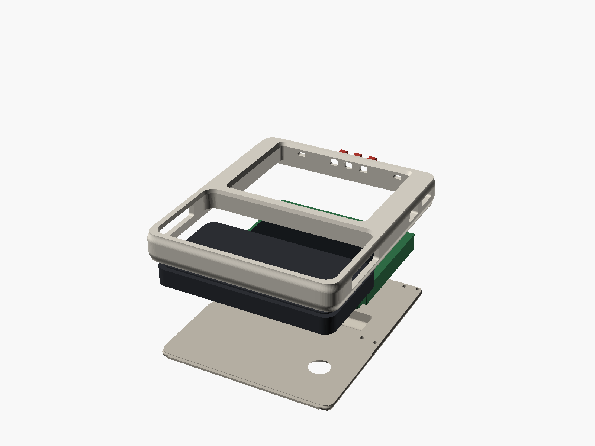
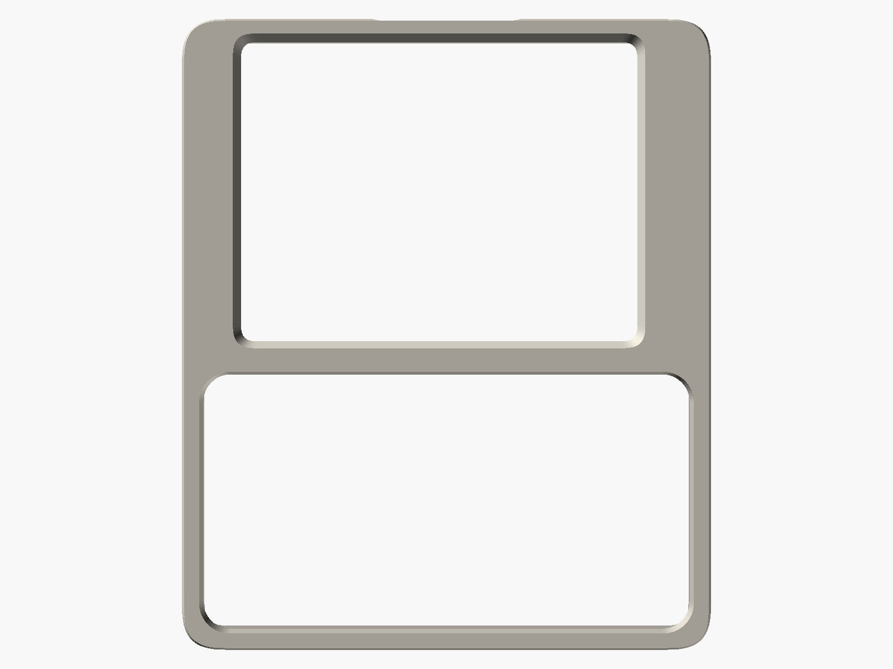
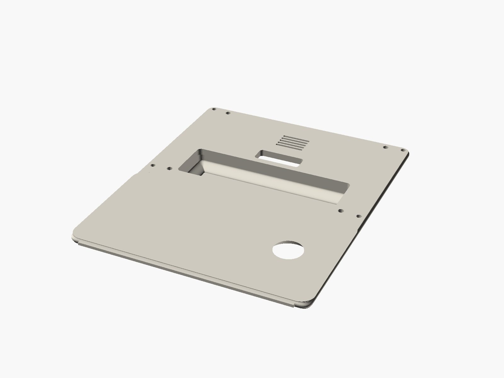

# cYbErDeCk

A single-form, overbuilt, minimum-footprint handheld terminal enclosure for the
**Waveshare ESP32-S3-RLCD-4.2** and a **Rii 518BT** mini Bluetooth keyboard.

Built for live use — musical live coding, control surfaces, and as a portable
node on a local network — rather than for a desk.

Dieter Rams read organically: one radius system, nothing applied, a single
perforated element — but with curvature continuity everywhere a surface turns,
so it reads as grown rather than extruded.

[](https://github.com/kylebsmith/ESP32-S3-RLCD-cYbErDeCk/actions/workflows/ci.yml)

<p align="center">
  
</p>
<p align="center">
  
  
</p>

```
116.6 × 139.1 × 16.6 mm   (+ 10.0 mm battery cowl)
2 printed structural parts · 4 screws · 76 automated checks
```

---

## What it is

Two rigid rectangles have to sit side by side, so most of the size of this thing
is arithmetic, not taste:

```
width  = wall + max(keyboard 110.2, board 93.5) + wall
height = wall + keyboard 59.4 + spine + board 70.1 + wall
depth  = back plate + board stack 11.0 + front face
```

`tools/validate.py` asserts each of those three equalities on every run. **The
enclosure cannot be made smaller without thinning a wall or crushing a part.**

What *is* a design choice is that it reads as one object, and that every corner
on it is continuous in curvature rather than merely tangent. A conventional
fillet is an arc meeting a line: the curvature jumps from 1/r to zero and the
eye reads a hard corner however large the radius. Every visible corner here is a
superelliptical quadrant of a larger corner size, tracking the same silhouette
while ramping curvature in from zero. Edges roll into the faces with zero slope
instead of being chamfered, and the battery swelling is blended out of the back
panel with a tangent foot, so it has no base line at all.

The entire front face, all four side walls and the inter-bay spine are a single
continuous body; the joint moves to the back, where a structural plate closes
the shell into a torsion box. There is no bezel line across the face you touch.

Where the language breaks it says so. The display aperture's corner is 4.2 mm
where everything else is 9 to 11.2, because the aperture height is trapped
between the active area it must not clip and the module edge it must still bear
on — the panel sets that corner, not taste, and the bound is asserted in CI.

| | Reference design | This design |
|---|---|---|
| Envelope | 151.65 × 116.77 × 18.00 | **116.6 × 139.1 × 16.6** |
| Battery bulge | +12.0 mm, separate clip-on cover | +10.0 mm, integral grip ridge |
| Wall | 2.90 mm | **3.20 mm** (8 extrusions, solid perimeters) |
| Split | bezel screwed onto a tray | monocoque front, joint at the back |
| Footprint area | 17 708 mm² | **16 218 mm² (−8.4 %)** |

12.55 mm shorter, 1.4 mm thinner, *and* thicker-walled.

## Print it

The three printable parts are committed in
**[`export/stl/`](export/stl/)** — chassis, back plate and button sprue — with
per-part orientations and print settings in
[`export/stl/README.md`](export/stl/README.md).

0.4 mm nozzle, 0.2 mm layers, no supports on any part.

> **Print the chassis alone first** and offer the board and keyboard up to it
> before committing to a full set. Nothing here has been printed yet.

## Build it

```sh
pip install -r tools/requirements.txt

openscad -D 'part="chassis"'   -o export/stl/chassis.stl   cad/cyberdeck.scad
openscad -D 'part="backplate"' -o export/stl/backplate.stl cad/cyberdeck.scad
openscad -D 'part="buttons"'   -o export/stl/buttons.stl   cad/cyberdeck.scad

python3 tools/validate.py          # 76 checks; non-zero exit if any fail
```

0.4 mm nozzle, 0.2 mm layers, no supports. Full instructions, BOM and print
orientations in **[docs/ASSEMBLY.md](docs/ASSEMBLY.md)**.

Two presets: `overbuilt` (3.2 mm walls, default) and `compact` (2.4 mm).

## How it is grounded

Every dimension is traceable to a source a third party can check. Nothing is
estimated, and nothing is traced off a picture.

- **Board geometry** comes from Waveshare's own published CAD package — Creo
  STEP assembly, dimensioned DXF, dimensioned PDF.
- **Keyboard geometry** — `108.5 × 58.2 × 10.2 mm` — comes from two independent
  manufacturer documents twelve years apart: the user manual filed as an exhibit
  under FCC ID `YIZRT-RII518`, and Riitek's current dimensioned product drawing.
  Cross-checked against three measured third-party enclosure pockets.
- **`tools/measure_reference.py`** re-derives every measured datum numerically
  from reference artefacts: planar sectioning with explicit world-preserving
  transforms, scan-line wall probing, ray-cast depth profiling, DXF group-code
  parsing.
- **`tools/validate.py`** renders the parts from source and booleans them
  against component mock-ups built from the datums. It is a gate, not a report.

The mounting-hole pattern — the datum everything else hangs off — was
established **three times independently**: from two unrelated enclosure designs
by different authors, and from the factory drawing. All three give
**85.500 × 62.100 mm**, agreeing to 0.001 mm.

Three further datums measured from a third-party enclosure *before* the factory
CAD was located matched it exactly: microphone offsets ±32.500, battery offset
−19.400, speaker grille height 10.45.

### It also corrected the internet

The figure `92.5 × 70.1 × 13.5 mm`, repeated across distributor pages for this
board, **conflates three different objects**. 92.50 is the PCB length; 70.10 is
the *removable moulded stand base*, which overhangs the PCB by exactly 1.00 mm
on one long edge (the PCB is 69.10); and 13.50 excludes the battery holder,
which protrudes a further 5.45 mm.

Discarding that stand base — removable, and not load-bearing once you notice the
standoffs are on the PCB — is what makes this deck thinner than the reference.

Similarly, the panel is not 4.2 inches (it is 4.173, exactly 84.80 × 63.60 mm),
and its active area is **not centred** on the board: it sits 1.60 mm off.

Full record, including every correction and every remaining gap, in
**[docs/DATUMS.md](docs/DATUMS.md)**.

## What is *not* proven

**Nobody has built this.** It is asserted internally consistent by 76 automated
checks; it has not been printed, and the components have not been offered up to
a physical chassis.

Before committing to a full set, print the chassis alone and check the four
measurements listed in
[docs/DATUMS.md](docs/DATUMS.md#measure-these-before-a-final-print). The one to
check first is **O-04**: the factory drawing and the reference enclosure
disagree by about 2.5 mm on the height of the side buttons.

There is also no FEA and no drop testing. The stiffness argument in
[docs/DESIGN.md](docs/DESIGN.md) is reasoning from section geometry — closed box
versus open channel, joint moved out of the peak-bending plane — not simulation.

## Drawings

Four dimensioned general-arrangement sheets in [`export/drawings/`](export/drawings/),
regenerated in CI. **Every dimension on them is measured from the rendered
mesh**, not typed in and not read from `parameters.scad` — a drawing annotated
by hand drifts from the model the first time anyone edits the model; one that
measures the mesh cannot.

| Sheet | |
|---|---|
| [1 — chassis](export/drawings/sheet1-chassis.png) | front elevation, vertical section, envelope derivation with PASS/FAIL |
| [2 — back plate](export/drawings/sheet2-backplate.png) | rear elevation, section through the battery cowl |
| [3 — assembly](export/drawings/sheet3-assembly.png) | horizontal sections through both bays, **components in place**, clearances called out |
| [4 — components](export/drawings/sheet4-components.png) | schedule of every component-facing dimension with its provenance |
| [5 — structure](export/drawings/sheet5-structure.png) | section modulus along the folding axis, open vs closed |
| [6 — corner lip](export/drawings/sheet6-corner-lip.png) | why the keyboard aperture corner is circular, and what it cost when it was not |

## How robust it actually is

`tools/structure.py` computes section properties from the rendered mesh at 90
stations along the axis the device folds about — second moment of area, section
modulus, and Bredt's formula for the closed cell. Classical section analysis,
not FEA: good for **ratios and weak-point location**, silent on absolute stress.

| | reference deck | this design |
|---|---|---|
| mean second moment `I` | 9 553 mm⁴ | **19 780 mm⁴** |
| mean section modulus `Z` | 891 mm³ | **1 657 mm³** |
| worst-section `Z` | 212 mm³ | **332 mm³** |

**2.07× the mean bending stiffness and 1.56× at the worst section, in a smaller
envelope.** Fitting the back plate is worth 3.47× on its own. Putting the joint
at the back rather than across the face puts it 0.85 mm from the neutral axis
instead of 14.25 mm, so it carries about **94 % less bending stress**.

It also corrected one of this project's own claims. The shell was described as a
closed torsion box; it is one over **10 % of its length**. Everywhere else the
front face is absent — that is what an aperture is — and the section is a U
closed only by the back plate. The deck is two open channels joined by one short
closed cell at the spine, and that cell is worth 13× in torsion. The spine is
not merely a shear web, it is the only closed cell in the device.

The weak point is named rather than hidden: **mid-keyboard-bay, `Z` = 332 mm³**,
because the keyboard aperture is 106.5 mm across a 116.6 mm body and leaves
about 5 mm of face each side. Nothing can be added there without covering keys.
The reference is weakest in the same place for the same reason. If this deck
fails in a drop, that is where.

## Accuracy against the original

`tools/audit_reference.py` compares every surface that locates, retains or gives
access to a component against the reference design this project measured — the
one that is known to work. It is a gate, not a report: anything that differs
without a recorded reason exits non-zero.

```
19 match   15 intended difference   0 to review
```

Exact agreement (±0.000 mm) on the mounting pattern, the display aperture, the
button pitch and apertures, the microphone span and apertures, and the speaker
grille field. On the keyboard specifically: the front aperture matches to
**0.002 mm**, the pocket corner to 0.064, and the eject port to 0.010.

The fifteen differences are each a recorded decision — the board pocket cut to
the bare PCB rather than to the discarded stand base, the keyboard pocket sized
to clear the body at its assumed tolerance rather than to one author's sample,
3.2 mm walls instead of 2.9.

**What is audited, and what is not.** Eleven keyboard-facing dimensions are
re-derived from the reference meshes on every run. The keyboard's service window
is not — it is measured once and recorded, because the tray is open at that edge
and the notch could not be isolated reliably from the surrounding opening. It is
listed in [DATUMS.md](docs/DATUMS.md) as measured-once rather than quietly
counted among the audited rows.

## Documentation

| | |
|---|---|
| **[DATUMS.md](docs/DATUMS.md)** | every dimension, its provenance, twenty recorded corrections, seven open items |
| **[DESIGN.md](docs/DESIGN.md)** | form language, why it is shaped this way, material and finish |
| **[METHODOLOGY.md](docs/METHODOLOGY.md)** | how the numbers were obtained and how to reproduce them |
| **[MEASURE.md](docs/MEASURE.md)** | caliper checklist for someone holding the actual hardware |
| **[ASSEMBLY.md](docs/ASSEMBLY.md)** | BOM, print settings, build order |
| **[PROVENANCE.md](docs/PROVENANCE.md)** | what was taken from whom, and on what basis |

## Tooling

| | |
|---|---|
| `tools/params.py` | the single reader for `parameters.scad`; every other tool goes through it |
| `tools/measure_reference.py` | metrology harness — regenerates every measured datum |
| `tools/validate.py` | 76-check design audit — the build gate |
| `tools/audit_reference.py` | component-facing accuracy against the reference |
| `tools/test_primitives.py` | unit tests for the geometry helpers; catches a primitive that lies |
| `tools/structure.py` | section properties from the mesh; stiffness against the reference |
| `tools/drawing.py` | dimensioned GA sheets, measured from the mesh |
| `tools/render.sh` | every published view, with its camera stated in the script |
| `tools/build.sh` | render everything and gate; what CI runs |

## Repository layout

```
cad/
  parameters.scad     single source of truth — every dimension, tagged and cited
  cyberdeck.scad      chassis, back plate, button sprue
  lib/util.scad       geometry helpers
  lib/components.scad worst-case component envelopes, for fit checking
tools/
  params.py             the single reader for parameters.scad
  measure_reference.py  metrology harness — regenerates every measured datum
  validate.py           76-check design audit — the build gate
  audit_reference.py    component-facing accuracy against the reference
  test_primitives.py    unit tests for the geometry helpers
  structure.py          section properties, stiffness, weak-point location
  drawing.py            dimensioned GA sheets, measured from the mesh
  render.sh             every published view, cameras stated in the script
docs/                 datum sheet, design rationale, methodology, assembly
export/reports/       machine-readable measurement and validation output
```

`cad/parameters.scad` is the only place a number may appear. A bare dimension
anywhere else in the CAD is a bug.

## Credits

This design measures, but does not copy,
**[nilseuropa/solar_term](https://github.com/nilseuropa/solar_term)** — the
SolarTerm enclosure and the [SolarOS](https://github.com/nilseuropa/solar_os)
project it houses. Their work is what got these two components living together
in the first place, and because their deck is a built, working device, its
pockets serve as hard physical bounds on components whose vendors round their
own figures.

No geometry from that project is used here, and it carries no licence of its
own. See [PROVENANCE.md](docs/PROVENANCE.md).

Board CAD published by [Waveshare](https://docs.waveshare.com/ESP32-S3-RLCD-4.2).

## Licence

[MIT](LICENSE) for the original contents of this repository. The dimensional
values are measurements of third-party products; they are facts, and are not
claimed as property.
