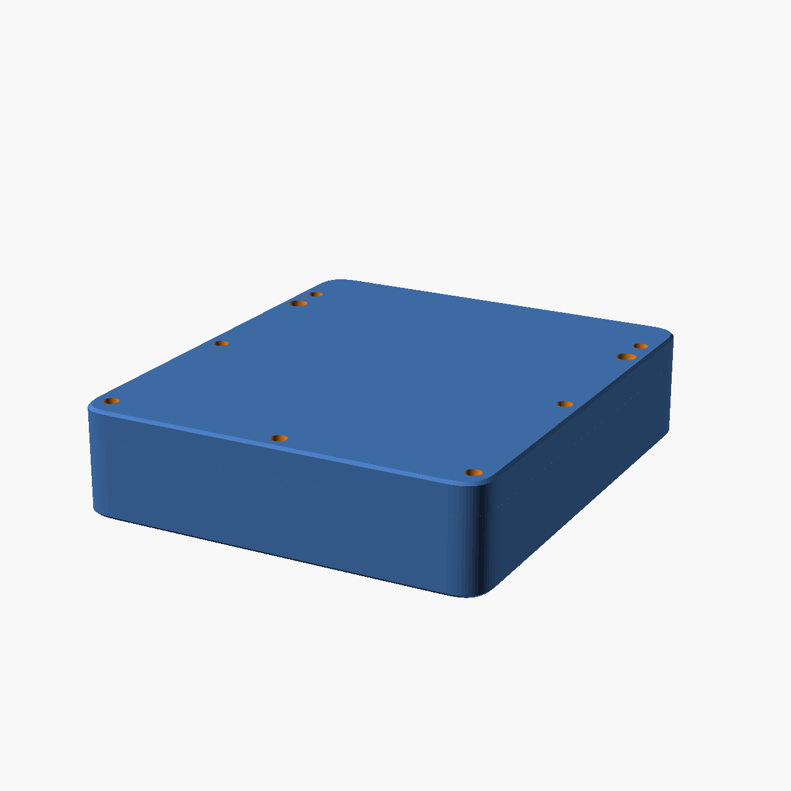

# Carry case

A sleeve the whole deck slides into, vertically, like a side bag. Front, back,
both flanks and the bottom; open only at the top. Every port is buried.
**Two halves, bolted.** `cad/carrycase.scad`, checked by `tools/check_case.py`.

| | |
|---|---|
| Outside | **144.7 × 166.4 × 37.4 mm** — nothing stands off it |
| Seam | **1:2.52**, low on the flank — not in the middle |
| Material | 396 cm³ model → **≈ 390 g of filament** (94 % of it perimeter shell) |
| Walls | **3.6 front and back**, 13.0 flanks, 13.0 floor, 12.0 rim |
| Edge | **1.0 mm chamfer at the faces**, superellipse corners in plan |
| Hardware | **7 × M5 × 20 socket cap + 7 × M5 × 10 heat-set insert**, 4 × Ø5×2 disc |
| Flock allowance | 0.80 mm per surface, + 0.40 clearance |
| Bed needed | **145 × 166 mm** per half |

## It is two parts, and not for printing

One piece could be printed. It could not be *reached into* — the magnet pockets
opened into a cavity 155 mm deep with nothing to get at them by, which is the
fault that started this revision (C-41). A plane parallel to the face fixes
that and pays four more times: both halves print flat and face-down, the magnet
pockets open upward on the bed, the inside becomes two open trays to flock, and
the back stops needing a spine to stand on.

Thirteen M5 socket screws round the perimeter into **hex nuts trapped at the
parting face**, so it assembles with one key and no spanner — nothing reaches down a
16 mm wall with a socket. The seam is not hidden: a 0.6 mm chamfer each side
makes it a 1.2 mm shadow gap, which is the only honest thing to do with a joint
you cannot fill.

The wall is **16 mm the whole way round**, and that is what lets the fasteners
go round with it. An M5 nut is 9.47 mm across corners; 16 mm leaves 3.27 mm of
metal either side, and the ring runs down the middle of it.

## The back is flat, and that is a print finding

The obvious back is a slab with a raised spine carrying the cowl channel.
Printed back-down the spine crown is the first layer and the slab bottom sits
11.00 mm above it — **3,100 mm² a side of downward-facing flat face**, needing
support. Flaring the spine out to meet the slab does not rescue it: 11 mm of
rise over 28 mm of run is **21°**, half of what FDM holds.

So the back drops to the channel floor everywhere. It costs 11 mm of depth and
returns a part with nothing under it.

## The fasteners are the outline

There is no list of screw coordinates anywhere in this project. `ring_path()`
takes the case's own outline, insets it to the middle of the wall, and samples
it at even arc length — so the fasteners follow the superellipse **round the
bottom corners** instead of stopping where a straight rail would have to.

Measured on the rendered part: **12 gaps between 32.1 and 35.8 mm**, spread
10.3 %. The low end is geometry, not error — a chord under-reads an arc.

**The ring is a U, and that is physics.** A fastener parallel to Z needs
material through the whole depth, and across the mouth there is none: the
deck's own cross-section has to pass through there. So it runs as far up both
flanks as it can and stops. What it does *not* do is stop at the corners, and
that is the check — 5 fasteners below the deck, 2 of them out past the cavity
in both bottom corners.

## Three numbers pinned to the deck, none to taste

| | |
|---|---|
| corner | `case_r = corner_blend × case_w / body_w` = **14.51** |
| height | `case_floor` solved so `case_h / case_w` = `body_h / body_w` = **28.30** |
| exponent | `form_n` = 3.2, the deck's own |

Holding the proportion fixes the case's **height**. It does not say where to
spend it, and that is the real decision. Spent at the mouth, the deck sits
24 mm down a hole and needs a scallop cut in the front to reach — and on a
150 mm face that scallop is not a detail, it is the silhouette. Spent at the
**floor** it is invisible, needs no scallop, and puts 28 mm of solid PLA on the
end you actually drop the thing on.

So the mouth is **12 mm**, which is a finger pad, and the floor takes the rest.

## Where the filament actually goes

Model volume is not filament. At 0.8 mm nozzle, 3 perimeters, 15 % infill, the
shell is 2.4 mm thick and this part is thin-walled enough that **94 % of it is
shell** — the front half is *entirely* perimeter. Hollowing saves nothing; the
infill is 6 % of the total.

So the levers are not where four revisions of argument put them:

| | saves |
|---|---|
| perimeters 3 → 2 | **130 g** — slicer setting |
| a 0.6 mm nozzle | **98 g** — slicer setting |
| floor 21.1 → 13.0 | 30 g |
| wall 4.0 → 3.6 | 25 g |
| flank 13 → 11 | 5 g |

**The flank cannot get thinner**, and the chain is short: the mouth has to pass
the deck, so there is no full-depth material across the top; fasteners therefore
live in the flanks and the floor; an M5 insert is Ø7.00 and wants 3 mm of metal
a side. 13 mm. The ways out are an external boss, M3 instead of M5, or accepting
it — not a wall-thickness decision.

## The strap lug is a hole

Eight versions. The last trapped a D-ring's bar in a bore straddling the parting
plane — clever, fiddly to print, fiddly to assemble, and it made the strap depend
on two 6 mm windows.

This is a hole. **Ø7.00, front to back through the flank**, so a cord or split
ring wraps the full 13 mm of wall and hangs outward, and the load goes into the
whole height of the flank above it. The parting plane cuts across it, so each
half prints it as a plain vertical bore with nothing overhanging. 3.00 mm of
metal either side — the same margin every fastener bore gets.

## Soft in plan, crisp at the face

The version before this softened every axis at once — superellipse corners *and*
a 3 mm roll at both faces — and an object with no defined planes reads as a
pillow. One axis gets the softness now: generous corners in plan, a hard **1 mm
chamfer** at the faces, so there is a top plane and a bottom plane and all the
turning happens at the corner.

## Print it face down

Front half on its face, back half on its back. Each is then **one flat bed face
and one open tray** — no bridge, no support, and the two surfaces anyone looks
at are the two that touch glass.

Measured on the rendered halves, in each one's own print frame:

| | front | back | budget |
|---|---|---|---|
| near-flat ceiling (< 15°) | **0 mm²** | **0 mm²** | 20 |
| shallow face (< 44°) | **0 mm²** | **0 mm²** | 250 |

Both zero, because the edge is **rolled rather than chamfered**. A 45° chamfer
sits exactly on the FDM limit and shows up in this measurement; a roll whose
derivative vanishes at both ends is *vertical* where it meets each face and only
reaches about 28° in the middle. The smoother edge is also the safer print.

Both halves need a **167 × 182 mm** bed.

## Finishing

The inside is meant to be flocked, which is why every internal surface carries
0.80 mm of pile allowance on top of clearance. **Without it the deck binds once
the flock is in**, which is a mistake you only get to make once. Two open trays
is the only sane way to do it.

The outside is meant to be filled, sanded and polished — but **not across the
seam**, which is a joint, not a blemish. Fill and sand each half, then assemble;
the 1.2 mm shadow gap, seven bolt heads and seven nuts are the
only things that break the surface, and all three are meant to be seen.

## Assembly

1. Glue the four discs into the front half's pockets, flush with the tray face,
   **polarity matched to the deck** — check with the deck before the glue grabs.
2. Flock both trays.
3. Mate the halves on the four printed locating pins.
4. Drive seven M5 × 45 from the front, holding each nut on the back with an
   8 mm spanner. Snug, not gorilla — the bearing annulus is PLA.

## Open

1. **The mouth is open, so the deck's top edge faces it.** The buttons and
   microphones sit on that edge and are reachable down an 8 mm recess. That is
   inherent to a sleeve; closing it needs a flap or a cap, which is a different
   object.
2. **The magnets are a seat, not a latch.** Four of them across a 2.00 mm gap
   are comparable to the deck's weight, not a multiple of it, and they are only
   fighting it in shear. Retention is the cowl channel, the flock, and carrying
   it mouth-up. The arithmetic is in C-41 and in `parameters.scad`.
3. **378 g is computed**, at 55 % of solid, not weighed. It is a heavy object;
   that was the brief.
4. **Flock pile is assumed at 0.80 mm.** Adhesive thickness varies by
   application; check a test coupon before committing the whole inside.
