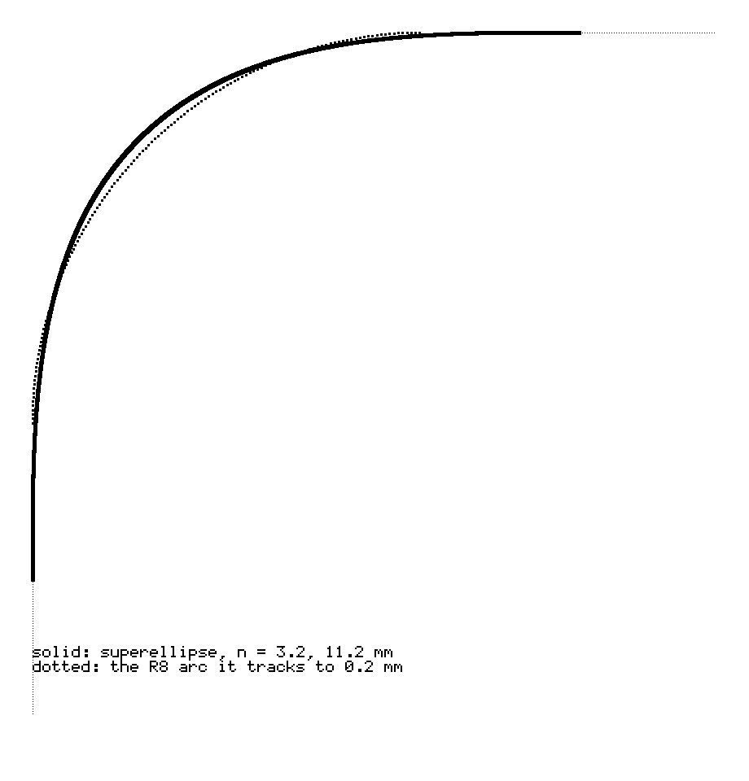
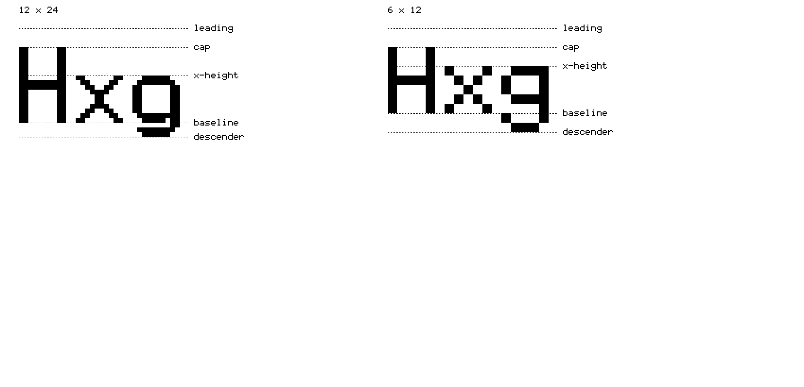
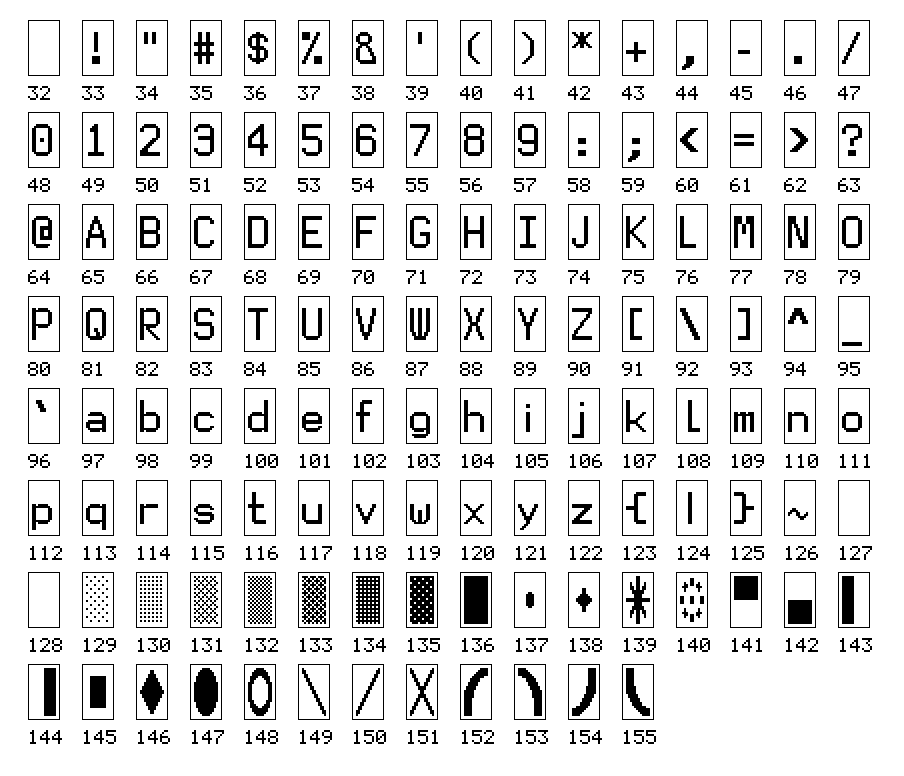
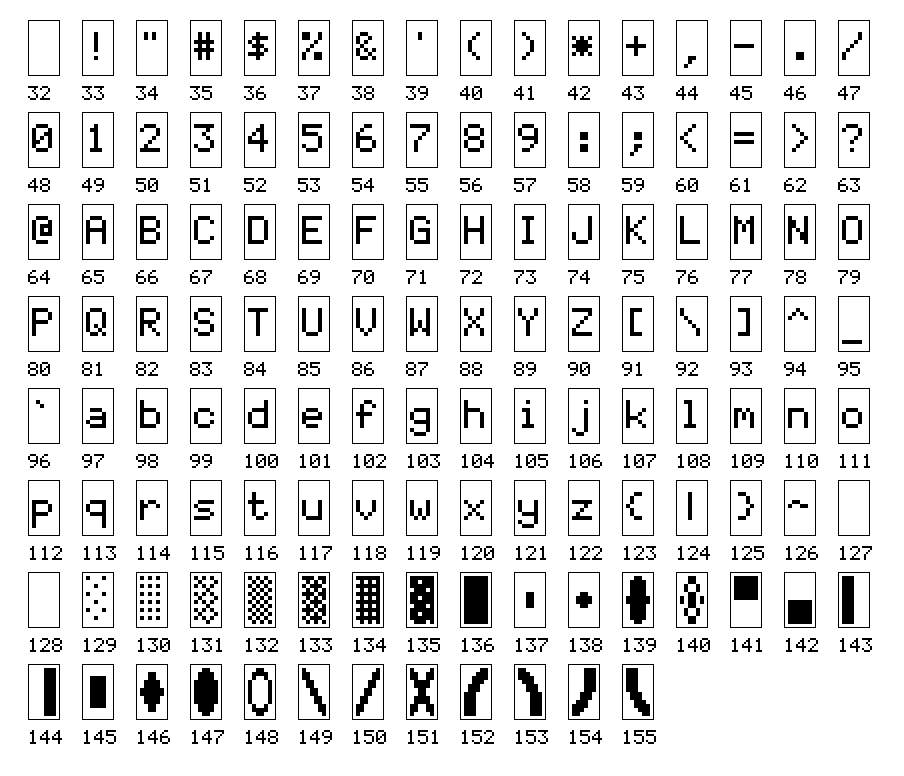
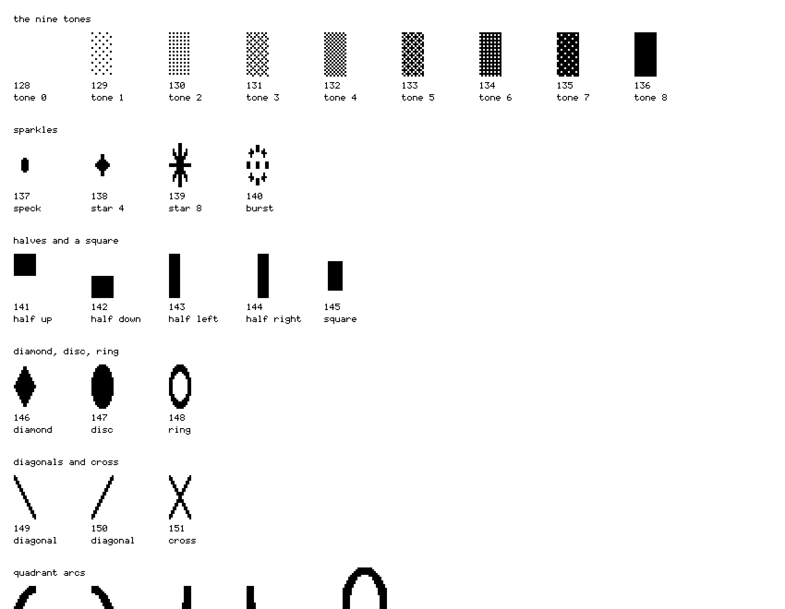
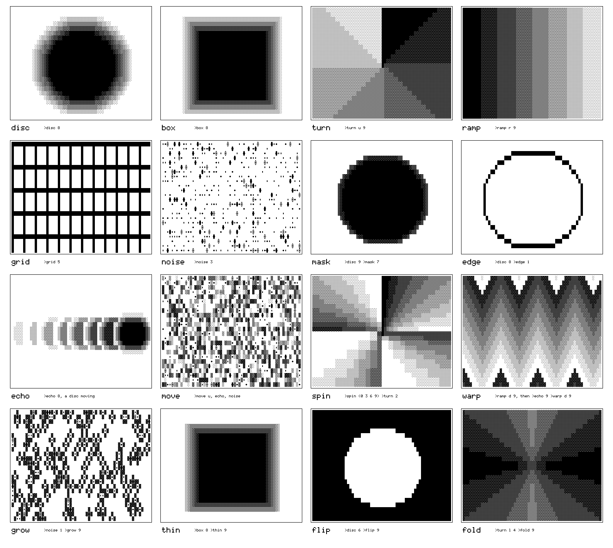
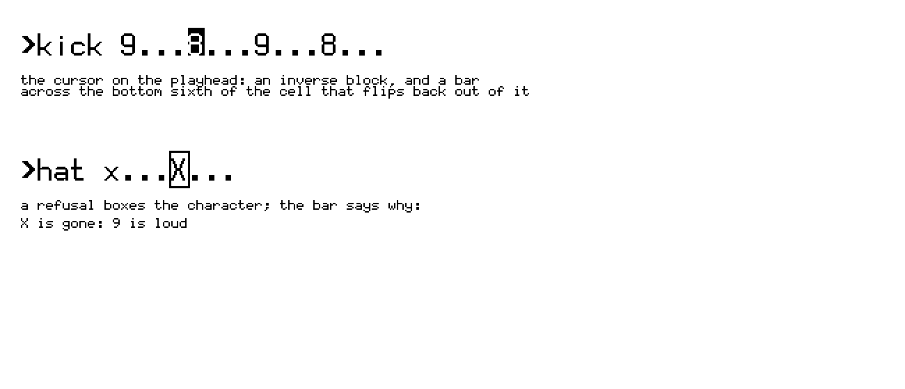

# CMF — colour, material, finish

*Everything the deck is made of and looks like — the object, the panel, the type,
the pictures, the printed matter — with each decision and where it is argued. The
baseline for the type overhaul in the last section.*

Every image here is drawn from the project's own sources: the glyphs from the
fonts the firmware builds, the pictures by the deck's own picture engine
(`firmware/components/viz/viz.c`, through `tools/zine_art.c`), the corner from the
curve the enclosure is cut with. `tools/cmf.py` regenerates them.

Three sentences decide most of what follows:

- **Dieter Rams, read organically.** Discipline and restraint, with surfaces
  grown rather than extruded ([DESIGN.md](DESIGN.md), *Form language*).
- **The constraint wins, and the form is honest about it.** Where a part sets a
  dimension, the part is named and the number asserted in CI.
- **One bit.** The panel has two states, reflect and absorb, and everything drawn
  for it — type, pictures, the zine — is made of those two.

---

## The object

| | |
|---|---|
| Envelope | **116.25 × 138.85 × 16.85 mm**, component-bound: `validate.py` asserts all three sums |
| Battery cowl | +10.0 mm ([README](../README.md)); [DESIGN.md](DESIGN.md)'s comparison table says +9.0 — **the two disagree**, open |
| Printed parts | chassis (~53 g PLA), back plate (~58 g), buttons (one sprue, ~0.5 g), cover (~60 g, variant 2) |
| Metal | 4 × M2 brass heat-set inserts — **the only metal on the object**, left visible |
| Fasteners | 4 × M2 × 6 ISO 10642 countersunk (shell ↔ plate) · 4 × M2.5 × 8 ISO 10642 (board) |
| Magnets | 8 × Ø5 × 2 mm N52, variant 2 (4 shell, 4 cover) |
| Gasket | 0.5 mm adhesive foam, round the display aperture |
| Inside | Waveshare ESP32-S3-RLCD-4.2 · Rii 518BT keyboard · one 18650 · speaker · microSD |

### Form

- **Continuous curvature, not fillets.** Every visible corner is a superelliptical
  quadrant, n = 3.2, corner size 11.2 mm. It tracks an R8 arc to within 0.2 mm, so the
  silhouette is the same, but curvature ramps in from zero instead of jumping to 1/r —
  the difference between a radius and a form.
- **Edges roll, they do not chamfer.** A smoothstep roll, faces inset 1.2 mm and
  arriving with zero slope: no arris to catch light.
- **The cowl grows out of the panel.** A tangent foot in the first 20 % of its rise, no
  base line; straight-sided in the middle band, because the cell needs the room.
- **One perforated element.** The speaker grille: five 1.2 mm slots on a 2.3125 mm
  pitch, 10.45 mm — Waveshare's own grille height. A vent field was removed: insurance,
  not requirement, and it could not be composed.
- **Controls recessed, not applied.** Three buttons in one 0.9 mm dish.
- **Where the language breaks.** The display aperture's corner is 4.2 mm, set by the
  panel (anything over ~4.6 clips its square corner). The keyboard aperture's corner
  is circular, 10.2 mm, derived from the keyboard's own ~10 mm radius — a superellipse
  there left the lip negative.

## Colour

| | |
|---|---|
| Shell | **warm neutrals — bone, oat, clay, moss.** Filled PLA or matte PETG |
| Avoid | **gloss black and saturated colour**: gloss turns the rolled edges into specular lines, and a saturated shell fights the panel — the RLCD reflects the room, so the body should return light to it, not absorb it |
| Metal | brass, uncoated |
| Concrete | white or grey Portland cement; iron-oxide pigment optional, at most 10 % of the cement's weight |
| The panel | no colour of its own: reflect or absorb. Its ground is whatever light the room has |
| Print | black on white, one bit — ink and paper, like the panel |

## Material

- **Shell:** a wood-, stone- or hemp-filled PLA, or matte PETG — materials that read as
  material, hide layer lines and age by dulling rather than scuffing bright.
- **Concrete jacket** (variant 3, [CONCRETE.md](CONCRETE.md)): the printed chassis
  stays as the core — no insert goes into stone, and 3 mm of plain concrete crazes on
  the first drop — and a **7.0 mm GFRC jacket** is cast round it, captive by geometry:
  131.9 × 148.1 × 23.9 mm, **201 g of concrete, ≈ 551 g all in**.

  | | |
  |---|---|
  | binder | white or grey Portland cement, 1 part |
  | aggregate | fine sand ≤ 1 mm, 1–2 parts — coarser bridges a 7 mm wall |
  | fibre | **AR glass**, 12–13 mm, 2–3 % of total weight — E-glass is eaten by the cement |
  | polymer | acrylic admixture, 10–20 % of the water — not epoxy, which will not emulsify |
  | water | w/c 0.32–0.38, with superplasticiser |

- **Carry case** ([CASE.md](CASE.md)): two printed halves, 130.7 × 166.4 × 37.4 mm at
  the waist, ≈ 436 g of filament, seven M5 × 16 socket caps into M5 inserts, flocked
  inside — every internal surface carries 0.80 mm of pile allowance. "A stone worn flat
  on two sides."

## Finish

- **Shell:** fuzzy skin on the **outer walls only**, 0.15–0.25 mm amplitude, 0.6 mm
  point distance — a fine stochastic grain that catches light like a mineral, while the
  front face, printed against the bed, stays smooth where hand and eye land. "The
  single highest-value finish decision."
- **Concrete:** the mould face *is* the finish. Printed moulding-side up, sealed with
  epoxy, wet-sanded 400 → 1000, carnauba-waxed, and vibrated on the pour.
- **Case:** filled, sanded and polished — but **not across the seam**, which is a
  joint, not a blemish. A 4.0 mm facet at 55° round each face; seven dished bolt heads,
  flush.

---

## The panel

| | |
|---|---|
| Part | 4.2" reflective LCD, Sitronix ST7305, **400 × 300, one bit, no backlight** |
| Pixel | 0.212 mm, square |
| Refresh | 32 Hz high-power mode, 1 Hz low-power |
| Grid | **12 × 24 cells → 33 × 12** (the default) · 6 × 12 → 66 × 25 (dense) |

The 6 × 12 cell was the arithmetic's recommendation and did not survive contact: on
the real panel a 5 × 7 body is too small and too thin. I said: *"with such a
naturally low contrast screen we gotta have sexy chunky letters."* The grid rule
that made the change free — cell height a multiple of 12, width only even — is in
[HARDWARE.md](HARDWARE.md).

## Type

Two faces, laid by hand pixel by pixel — at one bit there is no antialiasing to
lean on — and the art is the source: `tools/font12x24_art.py`, `tools/make_font.py`.
**Strictly monospace**, because ASCII art is a first-class element, not decoration.

| | 12 × 24 | 6 × 12 |
|---|---|---|
| body | columns 0–9, 2 px gap | columns 0–4, 1 px gap |
| leading | rows 0–2 | row 0 |
| cap height | rows 4–19 | rows 2–8 |
| x-height | rows 10–19 | from row 4 |
| baseline | under row 19 | under row 8 |
| descender | rows 20–22 | rows 9–10 |
| stem | **2 px** — thin strokes disappear on a reflective panel | 1 px |

### The whole library

Every code, 32–155, in both faces, at the same size so they can be compared:

Codes 32–126 are ASCII; 127 is blank; **128–155 are the tiles**.

### The tiles

Twenty-eight shapes the picture engine draws with: nine tones (a 4 × 4 ordered dither,
from nothing to solid — nine so a trail can fade through eight visible stages), four
sparkles, four halves and a square, a diamond, a disc and a ring, two diagonals and
their cross, and four quadrant arcs that tile 2 × 2 into one large circle.

**They are drawn in the cell's 1 : 2 aspect**, so everything round is a tall oval —
the disc, the ring, the four arcs together. A fact of the cell, not a choice; it is the
first question in the overhaul.

## Pictures

Six fields and ten operators, and no shapes: a field answers *how far is this cell
from the thing* in its own geometry, and a threshold cuts a shape out of the answer
([VERBS.md](VERBS.md), [MAP.md](MAP.md) §9.5). Every specimen below was drawn by
`viz.c`:

Order is a pipeline — history, motion, fields, thresholds, shaping, repetition — so
**`warp`, `move` and `spin` bend what came before**, which is why their specimens
carry a trail: in a single fresh frame they have nothing to act on. `route` changes
the order when a document says so.

## Marks

- **Cursor:** a solid inverse block.
- **Playhead:** a bar across the bottom sixth of every cell of the step that is
  sounding — 4 px at 12 × 24, 2 px at 6 × 12, "a single row disappears on a
  low-contrast reflective panel at arm's length; a third of the cell would read as a
  block". Applied *after* the inverse, so it flips back out of the cursor and a cursor
  on the playhead shows both (`cell_attr.h`, `textgrid.c`).
- **Refusal:** the wrong character boxed, the reason on the status bar in 30 columns.

## Printed matter

The zine ([zine/](../zine/README.md)): sixteen half-letter pages, one bit; one
thirty-column column — the deck's own line — at a 200 px left margin, 250 px top,
300 dpi; body in the 12 × 24 face at twice its size, notes in the 6 × 12 at twice its
size; one idea to a page; titles are lines you could type, with the deck's reply under
them; the folio is the step, sixteen pages being one bar; the one reversed page is
the room.

---

## Decisions

| decision | because | argued in |
|---|---|---|
| component-bound envelope | the keyboard and board sit side by side; the sums are asserted | DESIGN.md |
| superellipse corners, n = 3.2 | a fillet reads applied; curvature from zero reads grown | DESIGN.md |
| rolled edges, no chamfer | a chamfer is two more curvature breaks | DESIGN.md |
| one perforated element | confining it makes it a detail, not venting | DESIGN.md |
| warm neutral, matte | the panel reflects the room; gloss breaks the roll | DESIGN.md |
| brass inserts, visible | fasteners doing work are not hidden | DESIGN.md |
| fuzzy skin, outer walls only | grain where light lands, smooth where hands do | DESIGN.md |
| concrete as a jacket | inserts cannot go into stone; thin concrete needs fibre | CONCRETE.md |
| one bit throughout | it is what the panel is | HARDWARE.md |
| 12 × 24 default | the 6 × 12 was too thin to read on the panel | HARDWARE.md |
| 2 px stems | thin strokes vanish on a reflective panel | font12x24_art.py |
| strict monospace | ASCII art is load-bearing | me, 2026-09-20 |
| nine tones | a trail fades through eight visible stages | viz.c |
| fields, not shapes | a threshold makes the shapes; a star was a dead end | viz.c, VERBS.md |
| playhead a sixth of the cell | one row vanishes; a third reads as a block | textgrid.c |

## Open — the type overhaul

I said, 2026-09-27: **redraw both faces — more elegant, one bit, extremely legible,
and aligned with what is sometimes called Swiss Punk — and let text take part in the
picture.** What the redesign starts from:

**Fixed, because other things stand on them.** Strict monospace. Cells of 12 × 24 and
6 × 12 — height a multiple of 12, width even, which is what keeps partial refresh
aligned. Codes 128–155 stay the tiles, because the picture engine draws with those
numbers. At least 2 px of stem on the panel.

**Open, to be decided by drawing and measuring:**

1. **The round tiles in a 1 : 2 cell.** Tall ovals today. A circle needs two cells
   side by side, or tiles drawn as halves of a square.
2. **What the 6 × 12 is for.** It lost the default for being thin. It may be better as a
   second, bolder weight for dense pages than as the same letter, smaller.
3. **Text in the picture.** Letters are glyphs already; the engine draws glyphs. A
   `type` primitive — a word as a field, its size and place set by lanes like any
   other — would make the letter a picture element, the Swiss Punk move made literal.
4. **Confusable pairs.** 0 O, 1 l I, 5 S, 8 B, rn m — to be checked on the panel, at
   arm's length, in poor light.

**How it will be measured, not admired:** I read random strings off the
panel at arm's length, in daylight and indoors, with the current faces and the new;
errors per hundred characters, by glyph. A face that looks better and reads worse
does not ship.
