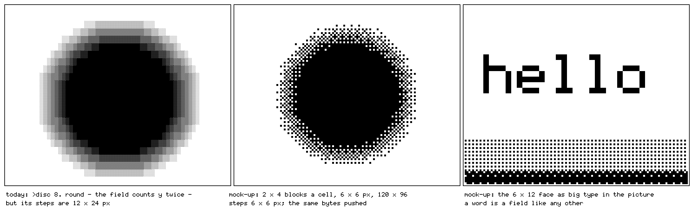

# Graphics — an analysis, and a brief

*2026-09-27. Analysis only: no code changed. What drawing costs on this panel, what
it must never cost, what the sixteen picture primitives really are, where the deck
sits among live-coding systems, and what to test before anything is added.*

The premise, from me: the processing belongs to the robustness and
determinism of the control system — the language, the clock, the output — and the
constraints are where this instrument lives. So every number below is either
measured on the deck (and says where) or labelled an estimate.

---

## The answer first

1. **Drawing cannot make a note late, and that is measured.** The clock runs on one
   core and everything else on the other ([OS.md](OS.md)). With five picture lanes,
   `echo`, `move` and the view streaming to HDMI, **6175 of 6175 ticks landed within
   100 µs; standard deviation 4 µs bare, 5 µs drawing** ([NETWORK.md](NETWORK.md),
   *Does drawing move the clock? No*).
2. **Graphics costs about 4 % of the other core** under the heaviest scene measured,
   and the largest term is not drawing but pushing bytes to the panel
   ([HARDWARE.md](HARDWARE.md), *The drawing was the budget*).
3. **So economy in graphics buys battery, headroom and simplicity — not timing.**
   The things that could still move the clock are not graphical (§7).
4. **Keep it that way by four laws**, which the system already obeys and should
   state: pictures at the rate of the music; cells, never pixels; push by area;
   nothing writes flash while it plays.

---

## 1. The panel, as a cost model

| | | |
|---|---|---|
| panel | 400 × 300, one bit, reflective, no backlight, 0.212 mm pixel | HARDWARE.md |
| a framebuffer byte | 4 × 2 pixels; a 12 × 24 cell is **36 bytes**, a 6 × 12 cell **9** | measured |
| a full frame | 15,000 bytes, **4.75 ms** at 24 MHz | measured |
| a small update | **~390 µs** of transaction against 3.6 µs on the wire | measured |
| damage | at most four rectangles, merged by least added area, snapped to 12 px × 2 lines | `st7305.c` |
| refresh | 32 Hz high-power, 1 Hz low-power | datasheet |
| optical ceiling | clean to about **23 Hz**, washed out above ~26 — reported for this panel by an emulator author | **unverified here** |

Three consequences follow, and they are the whole of graphics economics on this
device:

- **A frame costs its area, not its detail.** The bus carries bytes; a cell of fine
  structure and a cell of flat tone are both 36 bytes.
- **Small changes cost transactions, not bandwidth.** Coalescing is the lever, and
  the damage list already pulls it.
- **The ceiling on picture rate is optical, not the bus.** One frame a step at 124 bpm
  is 8.3 a second — well inside. Thirty-second notes (16.5 a second) approach the
  reported ceiling. A frame a tick (198 a second) is physically meaningless.

## 2. Where the cycles go

Microseconds of wall clock per ten seconds, from the loop's own heartbeat:

| | pictures | view out | draw | push | editor turns a second |
|---|---|---|---|---|---|
| idle, 2026-09-25 | 3 ms | – | – | – | 199 |
| heaviest scene, before the view fix | 52 ms | 2,570 ms | 117 ms | 189 ms | 142 |
| **heaviest scene, now** | **52 ms** | **40 ms** | **150 ms** | **189 ms** | **192** |
| idle, flashed 2026-09-27 | 3.6–4.2 ms | 0 | 0 | 0 | 199 |

The heaviest scene is about **431 ms of work in 10 s — 4.3 % of core 0**. Pictures are
**~0.6 ms a frame** for seven lanes over 1,060 cells. Even with no picture lane at all
the service polls for about 0.4 ms a second — nothing, but not zero.

**What each primitive costs.** Every one is a pass over at most 1,440 cells (the 60 ×
24 frame), in integer arithmetic:

| | work per cell | | work per cell |
|---|---|---|---|
| disc | an integer square root | mask, flip | a compare |
| box | two absolute values and a max | edge, grow, thin | five neighbours, one copy |
| turn | one division (a diamond angle) | move, spin, warp | one remap, one copy |
| ramp, grid | a multiply, a modulo | fold | a mirror, per fold |
| noise | a random number for a fraction of cells | echo | a subtraction |

None of these can reach a millisecond a frame on this chip; the measurement agrees.
**Optimising the pictures cannot buy a number anyone would hear or see** — which
HARDWARE.md already concluded, and the rule cuts both ways.

## 3. The costliest idiom is memory

`echo` is the only primitive that turns a sparse frame into a dense one: it lays the
last frame down one tone fainter, so **every inked cell changes every step**, and the
whole pane is damage. A lone disc pulsing on the beat pushes a few dozen cells; the
same disc with a trail pushes the pane. That is why the push is the largest term in
the heaviest scene, which is an `echo` and `move` scene.

Feedback is worth it — it is the difference between a blinking shape and an
animation, and it is most of what makes the pictures feel alive. But its price is
**area × rate**, and it should be spent knowingly: a smaller pane, or a trail at the
beat instead of the step, halves it.

## 4. The sixteen are macros

My observation is right, and it can be made exact. Sixteen names reduce to
**five operations on a grid of tones**:

| operation | what it is | the names that are it |
|---|---|---|
| **field** | a distance in some geometry, laid down as tone | disc (euclidean), box (chebyshev), turn (angle), ramp (projection), grid (periodic), noise (none) |
| **map** | a curve applied to each cell's tone | mask (threshold), flip (invert) |
| **neighbourhood** | a rule over a cell and its four neighbours | edge (gradient), grow (dilate), thin (erode) |
| **remap** | a cell fetched from somewhere else | move (translate), spin (quarter turn), fold (mirror), warp (displace) |
| **memory** | the last frame as an input | echo |

and one that is missing: **stamp** — put glyphs into the grid. That is §6.

What follows from it:

- **The engine could be one pipeline of five stages**, smaller than sixteen functions
  and cheaper to reason about, with the sixteen names kept as the vocabulary. Names
  are hand speed; nobody should type a distance metric to get a circle.
- **Pictures could be defined the way sounds are.** `>circle = disc` exists already; a
  picture defined as a composition — `>ring = disc edge` — is the same move the drums
  made when they stopped being built in. Whether that is a simplification or a new
  thing to learn is a question for the user tests, not for this document.
- **The fixed order is a hidden dependency.** The pipeline runs history, motion,
  fields, levels, shaping, repetition, so `warp`, `move` and `spin` act on what came
  *before* — in a single fresh frame they do nothing, which is why their specimens in
  [CMF.md](CMF.md) carry a trail. `route` states another order. It is correct and it is
  invisible, and invisible is what a first-time user cannot debug.

## 5. Resolution is nearly free; roundness is a tile problem

**The fields are already round**: `disc` counts vertical distance twice to cancel the
cell's 1 : 2 shape. What is coarse is the step: a picture's smallest mark is a 12 × 24
pixel cell.

*Left: the engine's own `disc 8`. Middle and right: a mock-up in Python, not the
engine.*

> **Corrected 2026-09-28.** The paragraph below mixed the two faces. A 60 × 24 frame
> exists only in the 6 × 12 face (360 × 288 pixels), where 2 × 4 blocks are 3 × 3
> pixels; in the default 12 × 24 face the editor's picture pane is **28 × 4 cells** (at
> most 28 × 5), where 2 × 4 blocks of 6 × 6 give 56 × 16. Mocking both on the engine's own
> frames showed the larger fact: in the default face a disc is a rectangle, because
> the picture's resolution is tied to the text's. The proposal that replaces this
> section — square **4 × 4 dots**, independent of the text — is in
> [wiki/pictures-and-type.md](wiki/pictures-and-type.md).

**Sub-cell blocks.** Divide each 12 × 24 cell into 2 × 4 blocks of 6 × 6 pixels —
square — and the 60 × 24 frame becomes **120 × 96 addressable blocks**, eight bits a
cell, 256 glyphs. The precedents are old and good: teletext's 2 × 3 mosaics, and the
2 × 4 patterns of Unicode's braille and octant blocks.

- **The push does not change**: a cell is still 36 bytes, whatever its bits are.
- **The field work rises eightfold** — every block evaluated instead of every cell.
  *Estimate*, scaling the measured 0.6 ms: up to ~5 ms a frame, at one frame a step
  about 4 % of core 0 at 124 bpm. To be measured before it is believed.
- **Tone moves from inside the tile to between the blocks** — ordered dither at 6 px,
  which is how Playdate, on a close cousin of this panel, does grey.
- **The round tiles stop mattering for pictures.** Disc 147, ring 148 and the four
  arcs are single-cell glyphs, so they are tall ovals; a mosaic draws circles out of
  square blocks and leaves those tiles to the text, where they are symbols.

This is the one change in this document that buys a visible difference for a small,
bounded cost, and it is still only a hypothesis until the host engine draws it and
the deck times it.

## 6. The text is already a picture

Text and pictures are cells on one grid, in one set of glyphs, and the view node is
sent **cells** — 1,071 bytes a frame — and turns them into pixels itself. That is the
right division of labour: the deck decides, something else rasterises.

So letters as image — the Swiss Punk move I asked for — is structurally free
here. A **stamp** operation writes glyph codes into the picture grid: the cheapest
primitive there could be, one store a cell and no field at all. With sub-cell blocks,
the 6 × 12 face's own bitmap becomes big type, one font pixel to one block (the right
panel above). A word would be a picture element like a disc, placed and sized by
lanes, fired by the kick. **Nothing in the language has to change except a name.**

## 7. What could still move the clock — none of it graphics

The effort worth spending on determinism is here:

- **Flash writes.** Any flash write stops both cores' caches; a journal write was
  measured at **13–18.6 ms**, which is why documents are not saved while playing
  ([main.c](../firmware/main/main.c), the autosave). Other writers — Wi-Fi credentials,
  SSH host keys, keyboard bonds — are **not known to be gated**. To audit: every flash
  write reachable while the transport runs.
- **The tick path lives in flash.** A cache miss on core 1 is a stall. Placing the tick
  path in IRAM would remove the dependency — measure the miss rate first.
- **The panel bus is shared by three tasks** (the main loop, the low-power timer,
  NimBLE) under one recursive lock — none of them on the clock's core, so it can delay
  a frame but not a note.

---

## 8. Where it sits

Not a ranking. Each neighbour does something the deck should know it is near, and
the facts below were checked against each project's own documentation, source or
papers on 2026-09-27.

| | runs on | display | timing | pictures | text and picture |
|---|---|---|---|---|---|
| **Strudel** | a browser | any | `Cyclist` queries ~200 ms ahead, every event +100 ms; Web Audio clock; MIDI via WebMIDI, offset 34 ms | a piano roll, highlights in the code | the code lights up as it plays |
| **Tidal + SuperDirt** | Haskell and SuperCollider on a laptop | any | timestamped OSC bundles sent ahead (0.05 s in BootTidal); `OffsetOut` puts each onset on its sample | none of its own | – |
| **Hydra** | a browser, the GPU | any | frames at the display's rate, usually 60 Hz | JavaScript chains compiled into one fragment shader; outputs `o0`–`o3` are ping-pong buffers, so `src(o0)` is feedback | code is text, picture is pixels |
| **Punctual** | a browser | any | Web Audio worklets and WebGL | one notation for sound and image | one notation, two media |
| **Gibber** | a browser | any | – | 2D and 3D graphics | source text highlights as a sequencer fires — the playhead's ancestor |
| **ORCA** | a laptop | its grid | frames and bangs | – | 26 letters on a grid are the program *and* what you see |
| **norns** | Raspberry Pi CM3, Linux with a realtime kernel | 128 × 64 OLED, 16 levels, drawn with Cairo | Lua coroutines, `clock.sync` to one tempo | scripted | separate |
| **Playdate** | 168 MHz Cortex-M7 | 400 × 240 one-bit Sharp memory LCD; 30 fps, 50 at most; **only changed lines are sent** | a game loop | 8 × 8 fill patterns, Bayer dither | – |
| **Uxn / Varvara** | a VM of ~100 lines of C | four colours, 8 × 8 sprites, 60 Hz | a screen vector | sprites | – |
| **PICO-8** | a fantasy console | 128 × 128, 16 colours, 8,192 tokens | 30 or 60 fps | sprites, a map | – |
| **Teletext, PETSCII** | broadcast; 8-bit computers | 40 × 24 cells; 2 × 3 block mosaics; PETSCII's arcs and quadrants | – | cells | the character set *is* the graphics set |
| **Bela** | BeagleBone Black, Xenomai, a PRU | – | audio round trip ~1 ms; analog paths ~0.1 ms; jitter ≤ 23 µs | – | – |
| **this deck** | ESP32-S3, the clock alone on one core | 400 × 300 one-bit reflective, cells | 96 ticks a beat; tick sd 4–5 µs, 100 µs worst measured; USB MIDI 0.03 ms at the host | five operations on a 60 × 24 tone grid, a frame a step | one grid, one set of glyphs |

**What the neighbours teach, rather than what they lose to.**

- **The browser systems buffer time because their platform cannot promise it.**
  Strudel looks ~200 ms ahead and adds 100 ms; Tidal sends bundles ahead. The deck's
  clock owns a core instead, so an edit lands on the next step with nothing queued.
  That is a different trade, not a better one: they get a laptop's power, the deck
  gets immediacy.
- **Hydra is the pictures' grammar at another scale.** Sources, transforms and
  feedback through `src(o0)` are the deck's fields, remaps and `echo`. The deck runs
  it on 1,440 cells, one bit, at the tempo of a sequencer — Hydra's shape at the rate
  of the music.
- **Gibber lit the code as it played** (Roberts et al. 2015); the deck's playhead
  does the same on the glass.
- **ORCA's text is its picture.** The stamp of §6 is the step toward that.
- **Playdate is the nearest physics:** a one-bit reflective panel where only changed
  lines are sent and grey is ordered dither — the economics of §1 and §5, shipped.
- **Teletext and PETSCII** are the precedent for tiles and for sub-cell blocks: cell
  graphics at 8-bit cost.
- **norns** gave the deck its two-core split ([OS.md](OS.md)); it keeps Linux and a
  realtime kernel where the deck gives the clock a bare core.
- **Bela** is the embedded benchmark for timing: ~1 ms audio round trip, jitter under
  23 µs (McPherson et al. 2016). The deck makes no audio, so the numbers are not the
  same quantity — its tick jitter is in that class for *events*, and that is all the
  comparison says.
- **PICO-8 and Uxn** are the lineage of limits chosen on purpose.

So the deck sits where these meet: a sequencer's timing, a live coder's notation, a
teletext-class display, and Hydra's picture grammar at the rate of the music. It does
not have to be better than any of them to be the one that fits in a hand.

---

## 9. The complexity worry, made measurable

**What a first sound needs:** a name, `x` and `.`, Ctrl+Enter, `>play` — four ideas.
**A first picture:** one more (`>disc 8`). The tiers in [pieces/](../pieces/README.md)
map what comes after: counts and cues, routes, parts, instances, definitions, rates.

A quick pass with the **cognitive dimensions of notations** (Green & Petre 1996), the
standard vocabulary for exactly this worry:

| dimension | here | risk |
|---|---|---|
| closeness of mapping | a step is a character; a bar is sixteen | low |
| viscosity | edit a line, run it | low |
| error-proneness | a refusal boxes the character and says why | low |
| hidden dependencies | a count decides whether a route is a cue or a sidechain; the picture pipeline's order; wrapped lines run twice | **high** |
| consistency | `:` means both *another one* (`disc:2`) and *a part of it* (`disc:x`) | medium |
| premature commitment | none — any line, any order | low |
| secondary notation | spaces are for the eye | low |

**The hidden dependencies are where complexity is actually growing**, not the verb
count. Each is a rule that is correct and invisible.

**A test protocol**, before any feature is added: five to eight people, each alone
with the deck and the zine, thinking aloud. Measured per person: time to first sound,
to first variation, to first picture, to first recovery from a refusal; refusals per
task; which ideas they reach for unprompted. Problems turn up with diminishing returns
— each new tester mostly re-finds what the last one hit (Nielsen & Landauer 1993) —
so run small rounds and change the deck between them. The hidden dependencies above
are the hypotheses to watch.

## 10. The brief — next steps, in order

1. **User-test what exists.** Nothing new until the protocol in §9 has run. It decides
   the rest.
2. **Write the four laws down** in [OS.md](OS.md): pictures at the rate of the music;
   cells, never pixels; push by area; nothing writes flash while it plays.
3. **Specify the five operations** and the sixteen names as macros over them, in the
   docs. Decide from the tests whether pictures may be defined as compositions.
4. **Prototype on the host, measure on the deck:** sub-cell blocks for fields, and a
   stamp for type — the host engine draws them, the deck times them. Adopt only on a
   number.
5. **Measure the panel's optics:** the 23 Hz claim, contrast in daylight and indoors,
   trails at 32 Hz — a phone camera at a fixed exposure is enough.
6. **Audit determinism where it is actually at risk:** every flash write reachable while
   playing; the tick path's flash residency.
7. **Then the type overhaul** ([CMF.md](CMF.md)) — after step 4, because sub-cell blocks
   change what the tiles are for.

## References

- Green, T. R. G., & Petre, M. (1996). Usability analysis of visual programming
  environments: A "cognitive dimensions" framework. *Journal of Visual Languages and
  Computing*, 7(2), 131–174. https://doi.org/10.1006/jvlc.1996.0009
- McPherson, A. P., Jack, R. H., & Moro, G. (2016). Action-sound latency: Are our tools
  fast enough? *Proceedings of NIME 2016*, Brisbane, 20–25.
  https://doi.org/10.5281/zenodo.3964611
- Nielsen, J., & Landauer, T. K. (1993). A mathematical model of the finding of
  usability problems. *Proceedings of INTERCHI '93*, 206–213.
  https://doi.org/10.1145/169059.169166
- Ogborn, D. (2025). Punctual 0.5: Combinatorial variation in a live notation for
  unified audiovisual improvisations. *ICLC 2025*, Barcelona.
  https://doi.org/10.5281/zenodo.15527253
- Roberts, C., Wright, M., & Kuchera-Morin, J. (2015). Beyond editing: Extended
  interaction with textual code fragments. *Proceedings of NIME 2015*, 126–131.
  https://doi.org/10.5281/zenodo.1179164
- The systems, from their own documentation and source: Strudel
  (codeberg.org/uzu/strudel, `cyclist.mjs`; strudel.cc technical manual); Tidal
  (github.com/tidalcycles/Tidal, `Target.hs`, `BootTidal.hs`) and SuperDirt
  (`core-synths.scd`); Hydra (hydra.ojack.xyz/docs; hydra-synth source); ORCA
  (github.com/hundredrabbits/Orca); norns (monome.org/docs/norns); Playdate
  (help.play.date/hardware/the-specs; sdk.play.date); Uxn/Varvara
  (wiki.xxiivv.com/site/varvara.html); PICO-8 (lexaloffle.com/dl/docs/pico-8_manual.html);
  teletext (ETSI EN 300 706); Unicode 16.0 (octants U+1CD00–U+1CDE5; braille
  U+2800–U+28FF); Bela (learn.bela.io).
- The measured figures: [HARDWARE.md](HARDWARE.md), [NETWORK.md](NETWORK.md),
  [VIEW.md](VIEW.md), [OS.md](OS.md); the deck's own heartbeat, 2026-09-27.
