# Pictures and type — the redesign, discussed

*Part of [the deck, top to bottom](README.md). 2026-09-28. A discussion for me, not a
build. Every picture on this page was drawn by the deck's own picture engine
(`firmware/components/viz/viz.c`); only the proposals are mocked, and each image says
which part. `tools/mock_pictures.py` redraws them all.*

The brief: get creative with the pictures and the letters, without giving up any speed,
because the clock and the control come first.

## The rule that frees the design

**At one bit on a fixed grid, how a glyph looks costs nothing to run.**

- **Drawing a cell** copies 36 bytes from a cache of pre-turned glyphs — 3.8 µs, whatever
  the bits are ([editor.md](editor.md) §2.4).
- **Pushing to the panel** costs the area that changed, not what is drawn in it.

So a redrawn letter or tile costs zero microseconds. What does cost is:

| | the cost |
|---|---|
| **how many glyphs** | memory: 36 bytes each in the cache; all 124 today are 4,464 bytes |
| **how big the grid** | work per frame, per cell or dot |
| **any per-pixel path** | work per pixel, which the grid exists to avoid |
| **flash writes** | never, while playing |

Be as inventive with the bitmaps as you like, and careful with the grid. One line to keep
it straight: **Swiss in the letter, punk in the layout.** Legibility is measured letter by
letter; the expression lives in how type is placed, scaled, inverted, layered and turned
into picture.

## 1. What the reference found

- **In the default face, the picture pane is 28 × 4 cells** — 336 × 96 pixels
  ([pictures.md](pictures.md) §1.7). Four rows of 24 pixels cannot hold a round shape: a
  disc is drawn as a rectangle, and a ring as a box.
- **The picture's resolution is tied to the text's size.** The compact face gives a
  58 × 10 pane. So choosing letters you can read costs the pictures most of their
  resolution.
- **Twelve of the twenty-eight tiles are never drawn by anything**: 141–146 and 148–155
  — the halves, square, diamond, ring, diagonals and arcs. The engine writes only the nine
  tones, the four sparkles and the small disc (147).
- **The round tiles are tall ovals**, and the tile generator's comment says the arithmetic
  makes them round (`tools/font_tiles.py`, `_dot`). It halves the vertical distance, which
  on square pixels makes an oval twice as tall as it is wide.

## 2. Proposal A — the pictures get their own pixels: square 4 × 4 dots

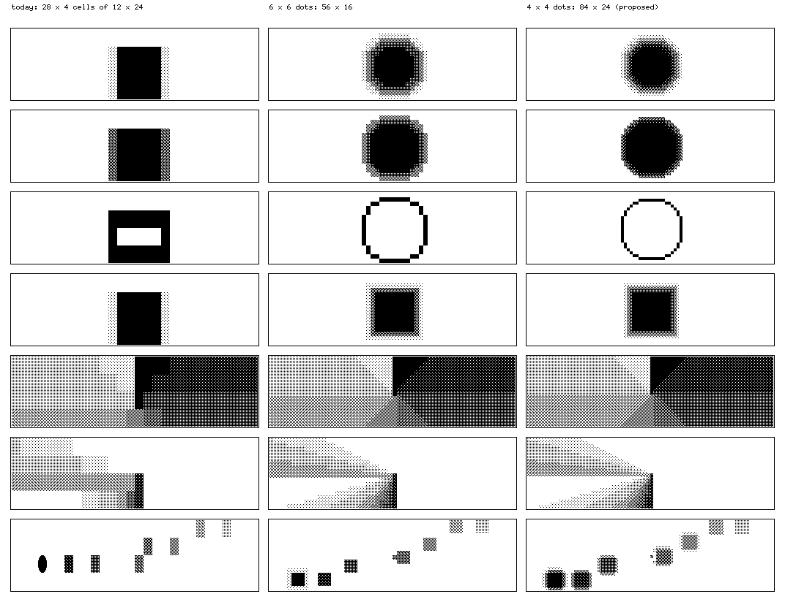

*The same 336 × 96 pixels, the same engine, the same seven scenes: a disc, a masked disc, a
ring, a box, a turn, the radar and the orbit from `orbitals`. Left, today. Right, the
engine built with square dots — a copy of `viz.c` with three edits, listed in
`tools/mock_pictures.py`.*

**What.** The picture engine draws on its own grid of 4 × 4-pixel square dots, whatever
face the text is in:

| | today | with 4 × 4 dots |
|---|---|---|
| the default pane | 28 × 4 cells | **84 × 24 dots** |
| the largest compact pane | 58 × 17 cells | 87 × 51 dots |
| the whole text area | — | 90 × 72 dots |

**Why 4 × 4:**

- **A dot is one period of the 4 × 4 ordered dither**, so the nine tones stay the nine
  tones: a field of one tone is seamless across dots, as it is across tiles now.
- **A dot is exactly two framebuffer bytes, in every orientation**, because every cell
  already is whole bytes. So drawing a dot is two stores from a table of nine — no
  per-pixel work at all.
- **A dot is square, so a circle is a circle.** The engine stops counting vertical
  distance twice.
- **The dots line up with the 12 × 24 cells**, three by six to a cell. In the compact face
  the pane starts two pixels off the dot grid, and gives them up.

**What it costs** — estimates, to be measured on the deck before anything is believed:

| | cost |
|---|---|
| engine | scales with the dots: 2,016 in the default pane against today's largest frame of 1,440 cells — about 1.4 × the worst case now, roughly **1 ms a frame** from the measured 0.6 ms for seven lanes over 1,060 cells |
| drawing | about 4,000 byte stores a frame — tens of microseconds |
| pushing | **unchanged**: the pane's area |
| the view node | 11 + 2,016 bytes a frame, against 1,071 today; the node draws dots instead of glyphs, which is simpler |
| the clock | nothing: all of it is on core 0, at a frame a step |

**What changes, and what does not.**

- **The engine:** vertical distance counts once instead of twice, in three places; the
  frame may be larger; the pane is drawn as dots rather than as glyph codes.
- **The language does not change:** `>disc 8` is still `>disc 8`.

**The dither stays on the panel, not on the shape.** When `move` or `echo` shifts a shape,
the tone pattern does not travel with it; it is applied where the dot lands. That is the
rule Panic gives for its one-bit panel, where a pattern moved one pixel flickers
([research.md](research.md) §3).

**What it gives up: the picture is no longer made of characters.** Three answers, which can
all be true:

- **A grain.** The same frame, read three by six dots to a cell, becomes today's tone
  tiles again. So "cells" can stay a look you choose, not a limit you live with.
- **Octants, if the picture must stay characters.** Divide each 12 × 24 cell into 2 × 4
  blocks of 6 × 6 pixels — the grid of Unicode's octants, and teletext's mosaics before
  them. The picture is then still a grid of characters, and the view node still receives
  characters. It is coarser (56 × 16 in the default pane, the middle column above), and 256
  block patterns do not fit the free codes 156–255 beside the letters.
- **The letters come back into the picture** — Proposal C.

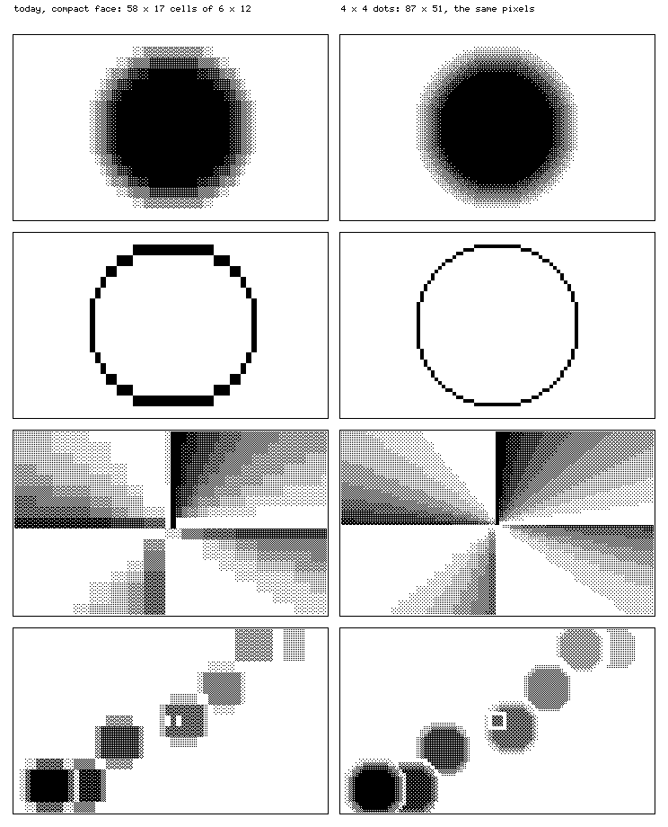

*The largest picture the editor gives today, the compact face split to 17 rows, against 4 ×
4 dots on the same pixels. At this size the difference is smaller. The default pane
above is where it matters.*

### Chosen, 2026-09-28: 4 × 4 dots, banded

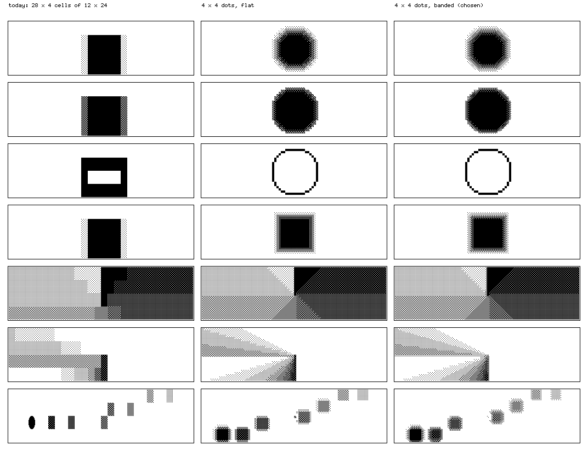

**Banded** means a grey dot is drawn from the tones at its four corners, interpolated across
its sixteen pixels and cut into the nine tones. Greys then meet in curves instead of
squares. **A solid or an empty dot stays exact.** Banding a one-dot line against the paper
beside it would turn it grey; the first try did exactly that to the ring, and the rule came
from it.

**It costs the clock nothing, and on this panel it is a lookup.** A 4 × 4 dot is exactly
one period of the dither, so how a grey dot looks depends only on its four corner tones:
9⁴ = 6,561 patterns of two bytes, 13 KB. The table lives in internal RAM, so the
display core never contends with the clock's code in the flash cache. Drawing a frame is
still two stores a dot. **Adopt on a number**: the heaviest scene with banding on, the
clock's jitter histogram beside today's — 6,175 of 6,175 ticks within 100 µs is the bar.

**The view node does it its own way.** The deck sends each frame as tones — dots, not
pixels — with the tick it belongs to. So the RP2040 on the HDMI tether can band at its own
resolution, and can **interpolate between frames**, as a switch. It knows exactly when each
frame was, so it can fill a 60 Hz screen between the deck's frame-a-step without costing
the deck anything. Later, the same node pairs wirelessly — an RP2040 with an ESP32-S3
companion on ESP-NOW, or a faster link — and joins the ensemble as a follower, as a second
deck does.

### The screen — what the greys are made of

A screen is the order in which a dot's sixteen pixels ink as its grey rises. Each one is a
table of sixteen numbers, or sixty-four, so every screen below costs exactly what Bayer
costs, and the clock never sees any of them.

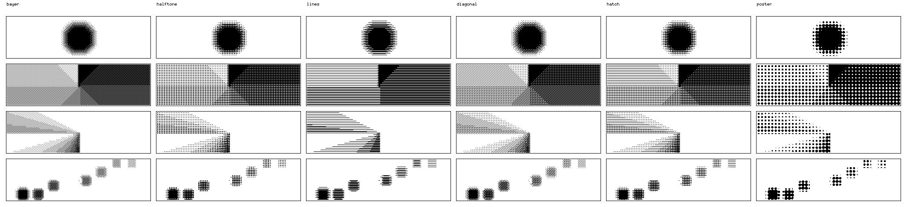

**First try: the screens print used.** A dot that grows (halftone; poster is the same at
twice the pitch), lines that thicken, the engraver's diagonals and hatching. My
verdict, 2026-09-28: **Bayer is the best by a large margin.** The numbers agree. Blur the
dots and the greys the engine meant alike, as the eye does at arm's length, and measure
the difference. Bayer's is the smallest; every print screen is 1.4 to 8.6 times further
off.

**Why Bayer wins.** In a 4 × 4 cell its order is the most even there is. At a quarter, a
half and three quarters there is exactly one best pattern: a square grid, a checkerboard,
the grid inverted. Bayer has all three. Anything else is less even somewhere.

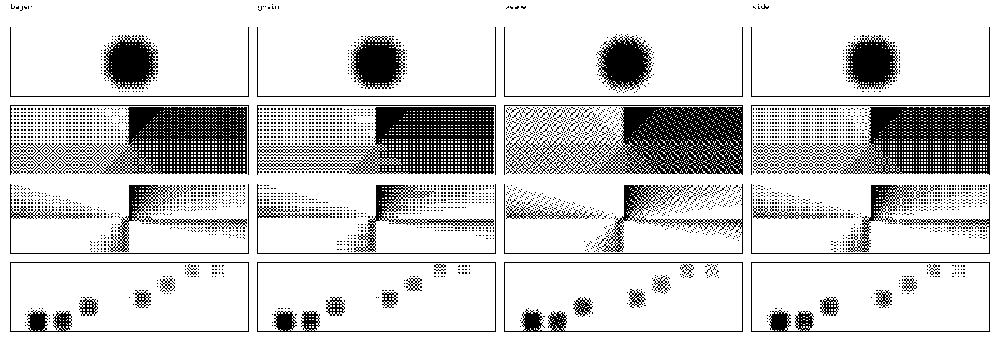

**So ours keep what they can of Bayer and change one thing on purpose:**

- **grain** — Bayer's quarter, half and three quarters, exactly. The greys between them
  grow along rows, so a scan line shows only there.
- **weave** — Bayer in every other dot, turned half a turn in the rest, like a
  chessboard. The faintest grey comes out almost hexagonal, more even than Bayer's; the
  rest weaves.
- **wide** — Bayer on pixels two wide, as the C64 drew its colour modes.

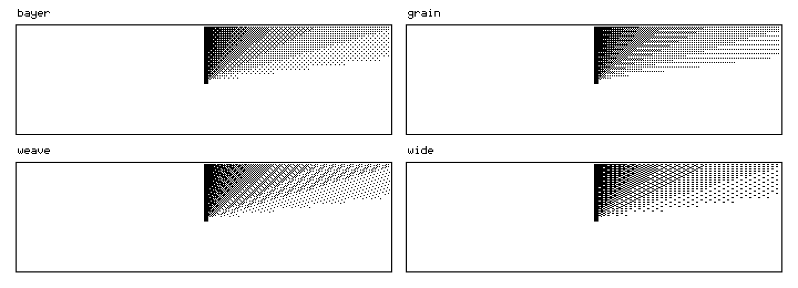

| screen | truth: distance from the intended greys, lower is truer | pixels changing alone: the radar | the orbit |
|---|---|---|---|
| **bayer** | **0.014** | 57.4 % | 56.7 % |
| grain | 0.023 | 58.2 % | 57.2 % |
| weave | 0.027 | 58.3 % | 57.3 % |
| wide | 0.028 | 1.9 % | 9.0 % |
| diagonal | 0.020 | 51.8 % | 44.3 % |
| hatch | 0.038 | 21.2 % | 16.8 % |
| halftone | 0.039 | 1.5 % | 6.6 % |
| lines | 0.063 | 0.1 % | 2.5 % |
| poster | 0.121 | 14.7 % | 13.3 % |

*Measured on the engine's own frames by `tools/mock_pictures.py`. Truth is the RMS
difference over four scenes, both blurred by σ = 1.2 pixels. A pixel changing alone is one
that changes from one frame to the next with no changed pixel beside it; that is what
sparkle is. The radar is ORBITALS' as it is now written - four beams taking turns - and
re-measured 2026-09-28; the first table was taken on the old one, whose corner never
moved (§ The radar, below).*

**Decided, 2026-09-28: Bayer.** My words: Bayer is the best, and these
variations are worse. None of ours is as true, and in a 4 × 4 cell none can be. The
originality goes where there is room for it: the view node, next.

### The view node — Bayer on the deck, anything on the screen

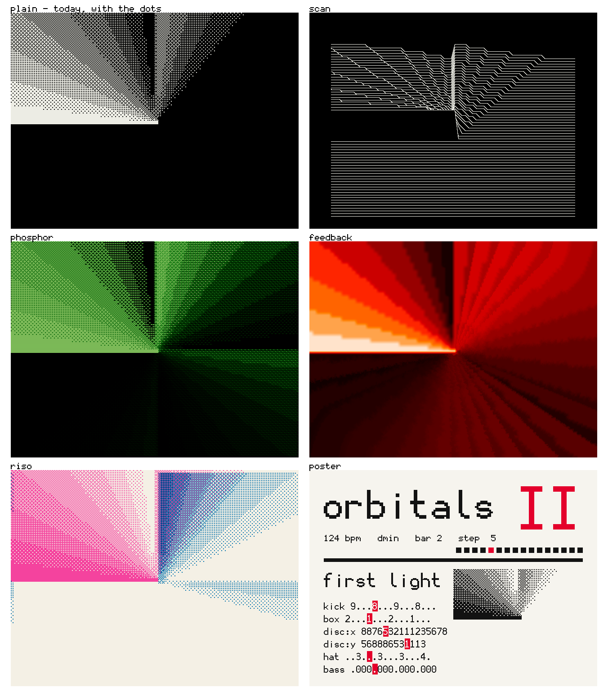

**Rebuilt 2026-09-29: every pixel the deck's.** I found the first modes "blurred and mushed": the node spread each grey over its neighbours and dithered it again, and phosphor and feedback resampled the frame. Now each cell is the deck's own 6×12 tile at 2×2 a pixel, 53×20 cells to the screen, and colour is played on channel 16 ([VIEW.md](../VIEW.md)). What follows is the first design, kept for the record; the picture above is the node's code, not a mock-up.

The deck keeps Bayer and sends the node what it sends today: one frame a step, and the
tick it belongs to. **Everything below happens on the node, so the deck pays nothing for
any of it.** Each mode is worked out from the frames and their ticks alone, so the same
performance draws the same pictures every time. And because each frame knows where it
falls in the bar, a mode can lock to the music: a zoom that kicks on the beat, a plate
that drifts once a bar.

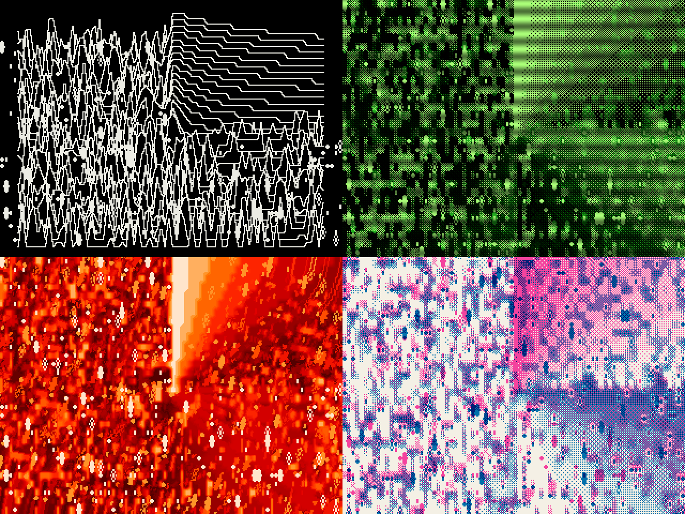

| mode | what it does | from | on the node |
|---|---|---|---|
| **plain** | the deck's picture, bit for bit, light on black | today's view | 640 × 480, one bit — what it does now |
| **scan** | each row of the picture drawn as a line, lifted by its greys, hiding what is behind it | Rutt and Etra's scan processor, 1972; the pulsar plot on *Unknown Pleasures*, 1979 | one bit; sixty lines a frame |
| **phosphor** | a green tube: what the beam lit glows and fades over about a beat, every other line dimmer | green-screen terminals | 320 × 240, eight bits and a palette |
| **feedback** | each frame is the last one, zoomed and turned a little, with the new picture on top; a full turn every two bars, a zoom on each beat | a camera pointed at its own monitor, the way video synthesists worked | eight bits; the RP2040's interpolators do the zoom and turn in hardware |
| **riso** | two inks out of register: pink is this step, blue the step before last, and the blue plate drifts with the bar | the risograph | eight bits; four colours |
| **poster** | a live Swiss poster of the piece: its name, the section in red, the lanes with the step each is on, the picture as Bayer at twice the pitch | the International Style | one bit and a red; **needs the deck to send its lines** as well as the frame |

The poster's type is the round face (§6) at four and six times, where its curves show.

**Built, 2026-09-28, and named:** `plain`, `scan`, `phosphor`, `feedback`, `riso`,
`poster`. A piece chooses with one more argument to the destination it already had,
`>send view scan`, not a new word. Written into a section, it changes with the piece, so
the performer makes it like everything else. The wire format, the sizes and what was
measured are in [VIEW.md](../VIEW.md).

**Not mocked yet, and as cheap:**

- **wobble**: rows pushed sideways by a wave locked to the beat, the demoscene's raster
  trick.
- **cycle**: the greys' colours turning a step at a time, palette animation as the Amiga
  did it.
- **moiré**: two lanes in two screens, overlapping.
- **trace**: glowing outlines, as the Vectrex drew.

**On the node, as built.** All six run at 320 × 240 in eight bits, doubled to 640 × 480,
from one frame a step; the images above are the mock-ups they were built from, and the
node follows them rather than matching them pixel for pixel. The poster's lines ride in
a control frame ahead of each picture. The deck's own glyphs — the sparkles, the small
disc, the arcs — are drawn as themselves over the dots, in its compact face
([VIEW.md](../VIEW.md)). The seventh, `code`, came 2026-09-29: 167 frames and 0 refused through all seven, from `tools/view_demo.py`. Measured earlier: 2,097 frames and 0 refused through all six modes,
driven from a computer. **Unverified:** the deck driving them end to end, and
how any of it looks - the node reports frames, not pixels, and there is no camera here.
Interpolation between steps is still to build.

### The radar — why a corner stood still

Watching ORBITALS on the screen, 2026-09-28: one corner of the radar never
moved, and it read as broken rather than as turning. It was `>turn 2` under
`>spin <0 3 6 9>`. `spin` turns the history — what `echo` laid down from the last
frame — and never this step's own source, so each fresh wedge landed in the same
quadrant while only its trails moved. On the deck's engine a quarter of the frame never
changed. No spin can fix that: turning the trails leaves the fresh wedge where it is,
and turning everything by one angle lands it in the same place again.

So the beam moves itself: four instances of `turn`, one to a beat, each with its own
heading written in front.

    >turn u 2...............
    >turn:2 l ....2...........
    >turn:3 d ........2.......
    >turn:4 r ............2...

They step anticlockwise because a `turn` fades clockwise from its leading edge, so each
trail falls behind its beam, and `echo 8` fades the trails where they were drawn. On the
deck's engine no inked cell now stays the same over a bar.

**`spin` turns what is drawn, not the whole frame** (2026-09-29): the spin
left "a set of static pixels" in every mode. It turned the finished frame round its
centre, so whatever sat near the centre or in a corner the turn never reached stayed
put. Now `spin` is a rate: each step adds its amount times ten degrees, and the
pictures that draw this step (`noise disc box turn ramp grid`) are turned by the
angle so far before the rest of the chain sees them. `spin 3` over a bar, and
`echo 8 turn 2 spin <0 3 6 9>`, leave **0 cells** the same from step to step
(`viz.c`, `turn_sources`; an integer sine table, so the host tests need no maths
library).

## 3. Proposal B, tried and set aside — smoothing the cells

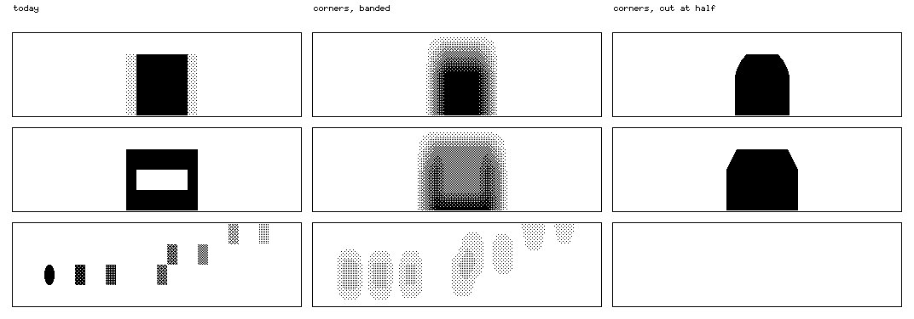

This draws each cell from the tones at its four corners, interpolated, then either cut
into the nine tones or cut once at half. It rounds edges, but it cannot add rows a
four-row frame does not have: the ring disappears, and the orbit smears. It is kept here
so nobody tries it twice.

## 4. Proposal C — type as a picture: `stamp`

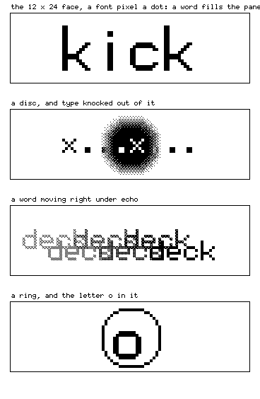

*Mocked: the discs and ring are the engine's, on square dots; the type is the deck's own
12 × 24 and 6 × 12 faces, one font pixel to one dot, laid in by the mock-up tool.*

**What.** A seventeenth primitive, `stamp`, that writes the deck's own letters into the
picture. In the default pane the 12 × 24 face, at one pixel a dot, is exactly 24 dots tall:
**a word fills the pane.**

**Its text is the name of whatever fired it.** `>route stamp kick` puts the word `kick` on
the screen with every kick, at the kick's velocity. The picture says what played — the
thesis made literal: the audience sees cause and effect without being asked to read code
([THESIS.md](../THESIS.md)). An alternative is the line's own pattern, so the rhythm
becomes type.

**What it costs:** one store for every inked dot, and no field to compute — the cheapest
primitive there could be.

**What it gives:** it composes with everything already there.

- `echo` leaves a trail of words;
- `move` drifts them;
- `mask` and `flip` knock them out of a field;
- `fold` mirrors them.

**Precedent:** in ORCA, the letters on the grid are both the program and the picture
([GRAPHICS.md](../GRAPHICS.md) §8).

## 5. The tiles, after the dots

| tiles | today | after |
|---|---|---|
| **tones** 128–136 | the picture's greys | the dots' greys: unchanged |
| **sparkles** 137–140 | `noise` | drawn as dot patterns |
| **small disc** 147 | `disc` at a radius of one cell | a disc one dot wide needs no glyph |
| **the other twelve** 141–146, 148–155 | never drawn | leave the picture engine; become symbols for the text, or go |

The twelve could become symbols the screen lacks. The pane's border is drawn with `+ - |`
today and could get real line-drawing corners. The status bar could get marks for the
battery, the radio and MIDI going out. Any round ones should be drawn round in pixels:
a bullet in a tall cell, not an oval.

## 6. The letters — what to redraw, and how to know

**What the 12 × 24 face already gets right.** Printed from the font itself:

```
  0           O           1           l           I           5           S           8           B
  ..######..  ..######..  ....##....  ....##....  .########.  ##########  ..######..  ..######..  ########..
  ##......##  ##......##  ..####....  ....##....  ....##....  ##........  ##......##  ##......##  ##......##
  ##..##..##  ##......##  ....##....  ....##....  ....##....  #########.  .########.  .########.  #########.
  ##......##  ##......##  ....##....  ....##....  ....##....  ##......##  ##......##  ##......##  ##......##
  ..######..  ..######..  .########.  ....######  .########.  ..######..  ..######..  ..######..  ########..
```

(Rows 4, 6, 11, 16 and 19 of 24, the ten body columns.) A dotted zero; a one with a flag and a foot; an `l` with a tail;
an `I` with bars; a flat-topped 5 beside a round S; an 8 beside a flat-backed B. And
because the face is monospace with a 10-pixel body, `m` fits one cell and `rn` takes two:
the classic confusions are answered by design.

**What the research says about this face** ([research.md](research.md) §3):

- **Keep the 2-pixel stem.** On a 16-pixel cap it is 1/8 of the height — the heaviest
  whole pixel inside the 1/12–1/6 band the FAA sets for screens, where heavier is
  preferred on dark-on-light displays like this one. Playdate's guide, for the nearest
  panel there is, asks for at least 2 pixels. Bolder still would read worse: weight helps
  small letters only up to a point.
- **The size is right.** The cap is 3.39 mm — about 23 arcminutes at 50 cm, the FAA's
  preferred 22–24.
- **The zero keeps its dot, full width — my call, 2026-09-28.** The research
  leans the other way: on a dot-matrix display a round zero with a mark inside was misread
  as O, and a narrow plain zero halved the errors (Vartabedian 1969). Readers agreed most
  on a zero narrower than O (Wendt 1969), and the FAA's labelling rules say the same. The
  narrow zero was drawn (the image below) and set aside. The reading test will say whether
  the dot alone holds 0 and O apart on this panel.
- **Treat the 6 × 12 as a label face, not a code face.** Its 7-pixel cap is about 10
  arcminutes, the FAA's floor for non-critical text, and its 1-pixel stem is thinner than
  Playdate's minimum. Terminus, a bitmap face that ships exactly these two sizes, carries
  its author's advice to avoid its own 6 × 12. A 2-pixel stem would not rescue it: on a
  7-pixel cap that is over-bold, which also reads worse.
- **Proof in confusion sets, not glyph by glyph**: 0/O/D/Q, 1/l/I/|, 5/S, 8/B, 2/Z, 6/8/9,
  7/1, rn/m. The worst pairs depend on the design, not on the letters (Maddox et al. 1977).
  Short strings like `x...9..x` and `kick` are where one bad pair shows.

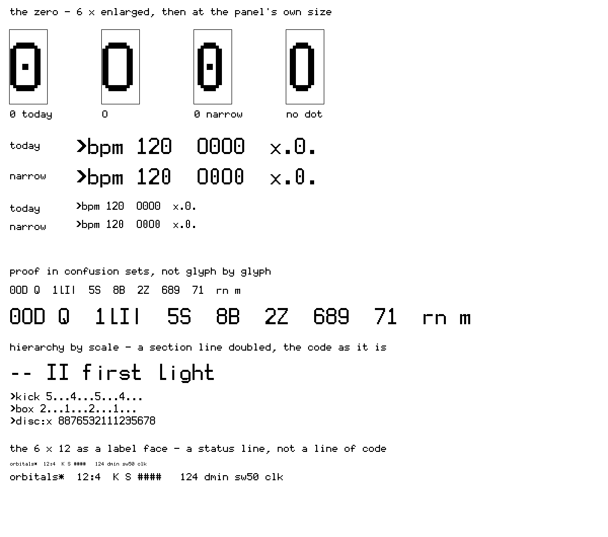

*The deck's own faces, drawn by `tools/mock_type.py`. The one invented glyph is the
narrower zero, made from today's by taking out two interior columns. Also shown: the
confusion sets as the panel draws them, a section line at twice the size, and the 6 × 12
face as a status line.*

**So the redesign starts with evidence, not taste.** [CMF.md](../CMF.md) sets out the reading
test:

- random strings, read off the panel at arm's length, in daylight and indoors;
- scored as errors per hundred characters, glyph by glyph;
- the errors form a confusion table: which glyph is read as which.

Redraw only the glyphs that the table shows people mistaking, starting with the zero. A face
that looks better and reads worse does not ship.

**The precedents for type drawn on a grid.**

- Crouwel's New Alphabet (1967) drew letters for cathode-ray screens on a 5 × 9 grid, with
  45° corners.
- Licko drew Emigre's first faces for the Macintosh's low resolution, and said "you read
  best what you read most".
- Kare drew the Macintosh's first bitmap faces.
- Gerstner (*Designing Programmes*, 1964) and Müller-Brockmann (*Grid Systems*, 1981)
  made the grid the design.
- Maeda's *Design By Numbers* (1999), from which Processing grew, made a small program the
  picture.

The deck stands in that line: a face drawn for its panel, pixel by pixel, and a grid that is
both the text and the picture.

**What is free to explore, because it costs nothing to run:**

- **Hierarchy by scale.** A document's section lines drawn twice the size, as 24 × 48 —
  the 12 × 24 face doubled, 144 bytes a glyph in the cache. Swiss typography builds
  hierarchy from size and weight contrast, not from new faces.
- **Glyphs tuned for what the language types most.** In a pattern line those are `.`, `x`,
  the digits, `[` `]` `<` `>` `%` `!` `/` `*` `_`. Could a rest read quieter and a hit
  louder? The same code draws prose too, so any change is tested on both.
- **The compact face as a face of its own**, not the small copy of the large one. It lost
  the default for being thin; for `+out`, `>lanes` and `>help` it could carry two-pixel
  verticals wherever five columns allow.
- **One curve.** The enclosure's corner is a superellipse, n = 3.2 ([CMF.md](../CMF.md)),
  and the face turns out to be drawn to it already. The programme below makes the curve a
  rule: at 12 × 24 it moves a pixel or two; drawn larger it is the whole character of the
  face.

### The face as a programme — speculative, two passes

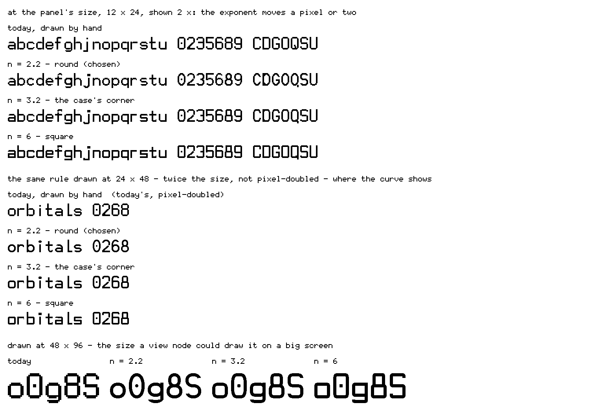

`tools/type_programme.py` draws the round letters from one rule, the superellipse
|x/a|ⁿ + |y/b|ⁿ = 1 that cuts the enclosure's corners, and keeps a 2-unit stroke even all
the way round the curve. Pass 1 varied only n:

- **Today's face is already the case's curve.** At n = 3.2 the programme's `o` comes out
  pixel for pixel identical to the hand-laid one. The face and the case were drawn to the
  same corner without anyone deciding it.
- **At 12 × 24 the exponent moves a pixel or two.** A bowl ten pixels wide has no room
  for more.
- **The curves show when the same rule draws larger**: section lines at twice the size,
  and the view node, which can draw from the rule at whatever size its screen wants. A
  programme scales; a bitmap laid by hand can only be doubled.
- **I chose n = 2.2**, the round one.

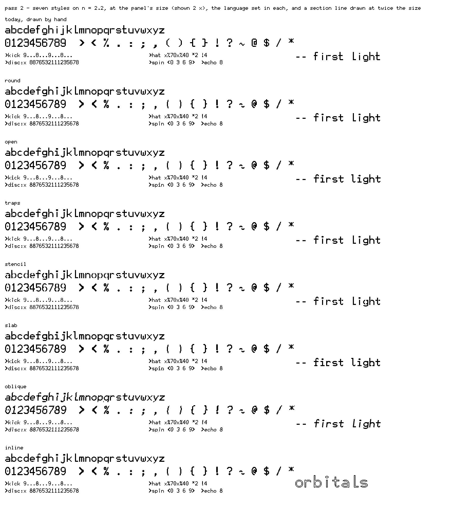

Pass 2 keeps n = 2.2 and draws **the punctuation the language lives on** by the same rule:

- **the dots are beads**, so `x...x...` reads as hits on a string;
- the chevrons have round joins;
- `%`, `( )`, `{ }`, `!`, `?`, `~`, `@` and `$` are drawn on the same curve.

Then seven styles on that base, each one idea. All seven were set aside with the pass:

| style | what it does | where it belongs |
|---|---|---|
| **round** | the base: n = 2.2, round dots | code, everywhere |
| **open** | wider apertures; `i j l t` spread across the cell | code, if the reading test finds those letters misread (Beier & Larson 2010) |
| **traps** | a notch where strokes meet | twice the size and up — at 12 × 24 a trap is a one-pixel nick |
| **stencil** | bowls and joins broken | titles and the view node: industrial, after Crouwel |
| **slab** | typewriter serifs | code, if 1 / l / I are confused — the strongest separation there is |
| **oblique** | slanted one pixel in eight | comments: a second voice without a second face |
| **inline** | hollow strokes | titles at three times the size and up; a stroke needs six pixels to be hollow |

None of it costs the deck anything to run: the deck keeps a bitmap, whatever drew it.

**Set aside, 2026-09-28.** My verdict on pass 2: none of it good enough. Letters
broken, blobs on the `>`, the `~` broken, the `f` broken in most styles, and most of it
poorly designed. The programme assembled letters from pieces of curve that did not meet
at the pixel. What replaced it is below.

### The round face — laid by hand, and checked

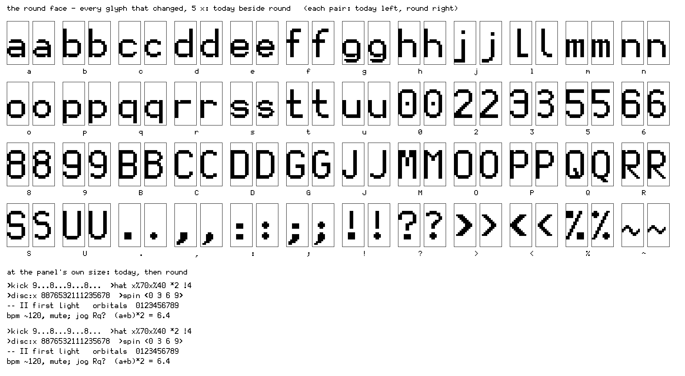

At 12 × 24 a face is made by hand, so this one is: `tools/type_round.py`.

**What changed, and only that.** It starts from today's face and gives every bowl, arch
and hook the same round corner, three steps where today's takes two. That corner is
n = 2.2 sampled at the pixel:

    today         round
    ..######..    ...####...
    .########.    .########.
    ##......##    .##....##.
                  ##......##

- **Straight letters stay today's**, and so do today's proportions.
- **Every terminal ends the same way**: one row past the curve's widest row, as in `c`.
- **Dots are round beads**: `.` `,` `:` `;` `!` `?` `%`.
- **`>` and `<` are three pixels a row**, the weight of a two-pixel stem on the diagonal.
  Today's are four, which is heavier than every stem beside them.
- **`~` turned half a turn is itself**, and falls as evenly as it rises.

Four of today's faults are fixed on the way. `i` and `j` had their dots at different
heights. `M`'s middle touched the rest only at pixel corners. `P`'s bowl had a notch that
`B`, `D` and `R` did not. And `Q`'s tail crossed its counter, which at this size fills it.

**Checked, every glyph.** `check()` refuses a glyph with:

- a piece that does not join;
- a pixel that touches the rest only at a corner;
- a stray pixel or a spur;
- a one-pixel neck;
- ink in the two gap columns.

A glyph that fails is boxed on the proof, and the tool exits non-zero. The check caught a
spur on `a` and today's `M` while this was drawn. All 48 changed glyphs pass.

**Honest limits.** `@`, `&` and `$` keep today's two-step corners. `m`'s arches are too
narrow for three steps, so only its outer shoulder steps in. None of it has been on the
panel yet, and the reading test still decides.

## 7. Around the table — what the best of the others would bring

My picture: the designers of the systems that matter, around one table, each
laying down the one thing their system does best. Each idea below was checked against the
system's own documentation or its designers' papers, 2026-09-28 (the sources are in
[research.md](research.md) §4). The right-hand column says what it becomes on the deck.

| seat | the idea it does best | on the deck |
|---|---|---|
| **Max** (Puckette) | a deterministic scheduler in logical time; the patch on screen documents everything that happens | **have it:** the clock owns a core, and the document is the whole score. Presentation mode — a performance face separate from the working one — is what the view node could become |
| **Pure Data** | each message cascade completes at one logical time and is never reordered; abstractions take `$1` arguments | **have it:** routes fire in rank order on one tick. Definitions are abstractions *without* arguments; with them, `>ring = disc edge` would be a composition — a question for the user tests |
| **SuperCollider** | language and synth are separate processes; events travel as time-stamped bundles sent ahead | **the same split, the other trade:** the deck's two cores divide the same way, but nothing is sent ahead — an edit lands on the next step |
| **ChucK** | time is a value; it stands still until the code advances it | **have it, declared:** the step is the unit of time, and a pattern *is* time |
| **Sonic Pi** | sleep advances virtual time, so loops do not drift; editing a `live_loop` updates it without missing a beat; built for classrooms | **have it:** an edit lands on the next step; refusals say why; the zine teaches. **Adopt:** its help beside every word — Tab completion shows each word's help ([completion.md](completion.md)) |
| **Impromptu / Extempore** | temporal recursion: a function schedules its own next call, and re-evaluating it hot-swaps the loop | **have it, declared:** counts and cues are temporal recursion without the function |
| **ixi lang** | a one-line score for each agent, rewritten on screen as the music changes; built so a tune appears in seconds | **have it:** one line is one lane, and the playhead shows the score moving. **Heed:** Magnusson's own survey found that constraints this tight suit sketching and improvising, but can limit in the long run. Depth has to come from composition — routes, definitions, other devices — not from more syntax |
| **TidalCycles** | a whole cycle in one quoted string; `(3,8)` for Euclid | **have it:** the notation, 51 of 51 corpus patterns. **The gap:** Euclid ([next.md](next.md) §3) |
| **Elektron** | per-step parameter locks; trig conditions — A:B, FILL, probability | **have it:** part lanes are locks written as lanes, and `%` is probability. **Idea:** a FILL held on a pad |
| **Ableton Live** | clips launched on a quantized grid; Follow Actions choose what plays next | **have it:** a count waits for its downbeat, and `name:end` routes are follow actions |
| **monome** | the grid does nothing by default — the software defines it; its lights are independent of its keys | **have it:** a knob is a name the deck defines. **Adopt:** make a satellite a *destination* too, so lanes can light its LEDs |
| **Bret Victor** | an immediate connection between a change and its effect — which he himself calls a prerequisite, not the point | **have it:** Ctrl+Enter lands on the next step, and the playhead shows it |
| **ORCA** | the grid is the program *and* the picture | **adopt:** `stamp` (§4) |
| **Playdate, teletext** | a one-bit panel where only changed lines are sent and grey is ordered dither; the character set as the graphics set | **adopt:** 4 × 4 dots (§2) |

**What the table would tell the deck to do next**, in its own order:

1. **Square dots** — Playdate's economics on this panel. Adopt on a number.
2. **`stamp`** — ORCA's idea, and the thesis made visible.
3. **Help at the cursor** — Sonic Pi's, through Tab completion.
4. **Euclid** — Tidal's missing mark.
5. **Satellites that listen** — monome's decoupled lights, as a destination.
6. **Definitions with arguments** — Pd's abstractions. Only if the user tests ask; it is
   exactly the kind of depth ixi lang's author warns about.

## 8. My decisions

**Decided, 2026-09-28:**

- **4 × 4 dots, banded** — adopted once the clock's jitter with it on matches today's.
- **The screen is Bayer.** Five screens from print and three of our own were drawn and
  measured; none is as true, and none looked better.
- **The zero keeps its dot, full width.**
- **The face's curve is n = 2.2.** It is laid by hand to that curve and checked (§6),
  because the programme's drafts broke letters.
- **The view node gets frame interpolation as a switch**, and later a wireless link.

**Still open:**

1. **`stamp`'s text** — the name of what fired it (recommended), or the line's pattern.
2. **The twelve unused tiles** — become symbols, or go.
3. **The round face** — adopt it as the deck's face (recommended), once it passes the
   reading test on the panel.
4. **Section lines at twice the size** — yes or no.
5. **The view node's modes** — which to build first, after interpolation.
